# It's clone (backup) of [my GitLab k8s-draft-kodmandvl/app repository](https://gitlab.com/k8s-draft-kodmandvl/app) 

# Проектная работа по курсу "Инфраструктурная платформа на основе Kubernetes"

Это проектная работа по курсу "Инфраструктурная платформа на основе Kubernetes". 

Поскольку инфраструктуру и приложения сопровождают потенциально разные команды, были созданы два отдельных проекта в GitLab: 

- infra (инфраструктура, развёртывание кластера Kubernetes)
- app (приложения, развёртывание наших приложений)

# Тема проектной работы: "Отказоустойчивая конфигурация PostgreSQL на платформе Kubernetes"

## Общие требования к проекту

<details>

<summary>Развернуть</summary>

## Общие требования 1/5 | Функционал

- Kubernetes (managed или self-hosted)
- Мониторинг кластера и приложения с алертами и дашбордами
- Централизованное логирование для кластера и приложений
- CI/CD пайплайн для приложения (Gitlab CI, Github Actions, etc)
- Дополнительно, при необходимости: инфраструктура для трейсинга, хранилище артефактов, хранилище секретов и др.

## Общие требования 2/5 | Оформление

- Автоматизация создания и настройки кластера
- Развертывание и настройки сервисов платформы
- Настройки мониторинга, алерты, дашборды
- CI/CD пайплайн для приложения описан кодом

## Общие требования 3/5 | Доступы

- Публично доступный репозиторий с кодом и пайплайном
- Публично доступный ingress кластера (белый IP, домен)

## Общие требования 4/5 | Документация

- README с описанием решения, changelog
- Шаги развертывания и настройки компонентов
- Описание интеграции с CI/CD-сервисом
- Подход к организации мониторинга и логирования
- Дополнительная информация про вашу платформу

## Общие требования 5/5 | Приложение

Есть два пути: 

1. Наш пример: Sock Shop by Weaveworks
2. Приложение на ваш выбор:
  - Opensource
  - Подходящаяя лицензия (MIT, Apache, etc)
  - Доступно по HTTP
  - Минимум три развертываемых компонента

</details>

# Техническое задание (частные требования) для HA-конфигурации PostgreSQL на платформе Kubernetes

Настройка HA-конфигурации PostgreSQL на инфраструктурной платформе Kubernetes является достаточно частным случаем для итоговой проектной работы, но не возбраняется руководителем курса, цитата: 

>> "Берете базу данных и показываете ее отказоустойчивость, ее бэкапы, ее тонкий тюнинг параметров, тюнинг различных балансировщиков для баз данных" 

В силу этой частной специфики, возможно, не все приведённые выше общие требования к проекту будут выполнены. 

Частный набор технических требований, техническое задание, что должно быть реализовано в нашем MVP HA-конфигурации PostgreSQL на платформе Kubernetes: 

- отказоустойчивость СУБД
- резервное копирование БД (и возможность восстановления из него)
- кастомизация СУБД (в т.ч. настройка параметров, расширений, предварительно созданных объектов)
- мониторинг
- балансировка
- UI для СУБД

# Local draft (локальный черновик)

Проработка технической реализации, исследование и эксперименты перед реализацией в Yandex Cloud (чтобы сэкономить денежные средства за аренду вычислительных ресурсов) проводились сначала в локальном кластере Minikube, подробности в [local_draft/README.md](local_draft/README.md) (папка local draft есть как в проекте infra, так и в проекте app). 

Стоит отметить, что в local_draft могут приводиться какие-либо секреты в открытом виде, но это всё используется в локальном кластере-черновике Minikube, который, кроме того, будет уже не существовать к моменту проверки проекта. 

До этого момента README.md в проектах Infra и App одинаковы, а далее они отличаются. 

# App

Все подробности, при необходимости, готов с удовольствием рассказать на презентации в Zoom-е. 

**Оглавление:**

- [Примечания по настройкам .gitlab-ci.yml](#примечания-по-настройкам-gitlab-ciyml)
- [GitLab Agent](#gitlab-agent)
- [Namespaces](#namespaces)
- [Ingress Nginx](#ingress-nginx)
- [Secrets](#secrets)
- [Cert Manager](#cert-manager)
- [Собственный CA](#собственный-ca)
- [Выбор оператора](#выбор-оператора)
- [Мониторинг, часть 1](#мониторинг-часть-1)
- [Свой образ и кастомизация](#свой-образ-и-кастомизация)
- [Локальные исследования и тюнинг](#локальные-исследования-и-тюнинг)
- [Свои созданные Helm Chart-ы](#свои-созданные-helm-chart-ы)
- [Отказоустойчивость](#отказоустойчивость)
- [Бэкапы](#бэкапы)
- [Восстановление](#восстановление)
- [Мониторинг, часть 2](#мониторинг-часть-2)
- [Стартовая страница проекта App](#стартовая-страница-проекта-app)
- [Дальнейшие планы по развитию проекта App](#дальнейшие-планы-по-развитию-проекта-app)

## Примечания по настройкам .gitlab-ci.yml

- Большая часть этапов в итоговой версии проекта прописана с условием 'when: manual',  т.к. при бесплатном ограниченном использовании есть лимит на использование runner-ов и проблематично для всех этапов использовать сборки каждый раз
- По этой же причине для сборки моего кастомного образа используются не встроенные GitLab-переменные CI_REGISTRY_IMAGE и CI_COMMIT_SHORT_SHA (как в примерах draft1.gitlab-ci.yml и draft2.gitlab-ci.yml), а явно прописанный образ и тег
 
## GitLab Agent

Настройку и подробности по gitab-agent см. в [gitlab-agent/README.md](gitlab-agent/README.md). 

## Namespaces

Для проекта, как мы увидим в дальнейшем, используются следующие [неймспейсы](./namespaces/namespaces.yaml) (помимо неймспейса gitlab-agent): 

- cnpg-system (для нашего оператора)
- mypg (для нашего кластера, пулера, pgadmin)
- web (для нашего Nginx-приложения для стартовой страницы проекта)
- ingress-nginx
- cert-manager
- mon (для мониторинга нашего кластера)

В [gitlab-agent/README.md](gitlab-agent/README.md) приведен вывод джоба создания неймспейсов, необходимых для нашего проекта ([stage namespaces в .gitlab-ci.yml](.gitlab-ci.yml)). 

## Ingress Nginx

Для работы нашего приложения и доступа к нему извне нам понадобится Ingress Nginx Controller. 

Для его установки воспользуемся стандартным Helm Chart-ом ([пример из документации Yandex Cloud](https://yandex.cloud/ru/docs/managed-kubernetes/tutorials/ingress-cert-manager)): 

```bash
helm repo add ingress-nginx https://kubernetes.github.io/ingress-nginx && \
helm repo update && \
helm install ingress-nginx ingress-nginx/ingress-nginx -n ingress-nginx
helm ls -n ingress-nginx
kubectl get all -n ingress-nginx
```

Добавим установку Ingress-Nginx в [.gitlab-ci.yml](.gitlab-ci.yml) (stage ingress-nginx). 

Был успешно установлен в [джобе](https://gitlab.com/k8s-draft-kodmandvl/app/-/jobs/6587193749): 

<details>

<summary>Вывод джоба</summary>

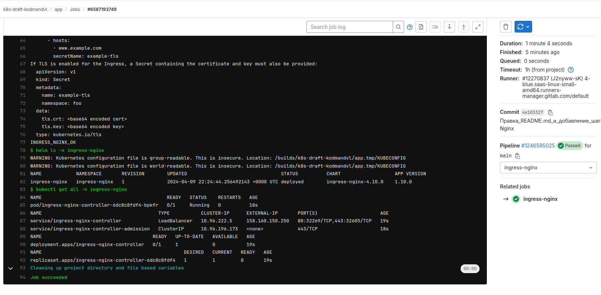 

</details>

Из вывода джоба или из `kubectl get svc -n ingress-nginx` узнаем внешний адрес LoadBalancer-а для Ingress Nginx Controller-а: `158.160.150.250`. 

Как мы увидим в дальнейшем, он понадобится нам в т.ч. для переопределения `values.yaml` в написанных мной Helm Chart-ах. 

Следует отметить, что в настройках Yandex Cloud своего облака нам нужно сделать этот адрес статическим и включить защиту от удаления, чтобы наше приложение не "разъехалось" после перезапуска кластера Kubernetes: 

<details>

<summary>Virtual Private Cloud / IP-адреса</summary>

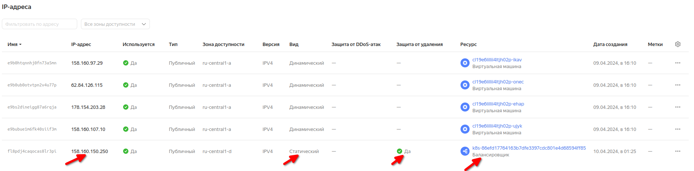 

</details>

## Secrets

После создания неймспейсов и до деплоя остальных вспомогательных и основных компонентов нашего проекта нам необходимо создать соответствующие [секреты](secrets_templates/README.md): 

<details>

<summary>список секретов</summary>

- myca-key-pair-secret.yaml - сертификат и ключ моего удостоверяющего центра сертификации (CA)
- application-user-secret.yaml - имя пользователя-владельца целевой прикладной БД CNPG и его пароль
- postgres-user-secret.yaml - имя и пароль суперпользователя БД CNPG
- post-sql-secret.yaml - постинсталляционный SQL-скрипт для нашего кластера CNPG, но с чувствительными данными внутри
- s3-secret.yaml - секрет для доступа к объектному хранилищу бэкапов на S3
- pgadmin-secret.yaml - e-mail и пароль административного пользователя нашего statefulset-а PGAdmin4

</details>

Для хранения наших секретов воспользуемся GitLab-переменными (защищенными и с включенным маскированием). 

Ниже пример, как это будет работать для pgadmin-secret.yaml. 

<details>

<summary>развернуть подробности</summary>

Скрипт для проверки: 

```bash
$ kubectl get -n mypg secrets
No resources found in mypg namespace.
$ cat pgadmin-secret.yaml
apiVersion: v1
kind: Secret
metadata:
  name: pgadmin-secret
type: Opaque
data:
  PGADMIN_DEFAULT_EMAIL: "dXNlckBkb21haW4uY29t" # echo -n 'user@domain.com' | base64 -w 0
  PGADMIN_DEFAULT_PASSWORD: "cGFzc3dvcmQ=" # echo -n 'password' | base64 -w 0

$ export PGADMIN_SECRET=`cat pgadmin-secret.yaml | base64 -w0`
$ echo $PGADMIN_SECRET | base64 -d > /tmp/pgadmin-secret.yaml
$ kubectl apply -n mypg -f /tmp/pgadmin-secret.yaml 
secret/pgadmin-secret created
$ rm -v /tmp/pgadmin-secret.yaml
удалён '/tmp/pgadmin-secret.yaml'
$ kubectl get -n mypg secrets pgadmin-secret -o yaml
apiVersion: v1
data:
  PGADMIN_DEFAULT_EMAIL: dXNlckBkb21haW4uY29t
  PGADMIN_DEFAULT_PASSWORD: cGFzc3dvcmQ=
kind: Secret
metadata:
  annotations:
    kubectl.kubernetes.io/last-applied-configuration: |
      {"apiVersion":"v1","data":{"PGADMIN_DEFAULT_EMAIL":"dXNlckBkb21haW4uY29t","PGADMIN_DEFAULT_PASSWORD":"cGFzc3dvcmQ="},"kind":"Secret","metadata":{"annotations":{},"name":"pgadmin-secret","namespace":"mypg"},"type":"Opaque"}
  creationTimestamp: "2024-04-10T09:17:30Z"
  name: pgadmin-secret
  namespace: mypg
  resourceVersion: "380541"
  uid: b8f830af-e8e2-4fcb-aaa4-daeb81c08c0e
type: Opaque
```

Скрипт работает корректным образом. 

Добавим переменную в GitLab => Settings => CI/CD => Variables: 

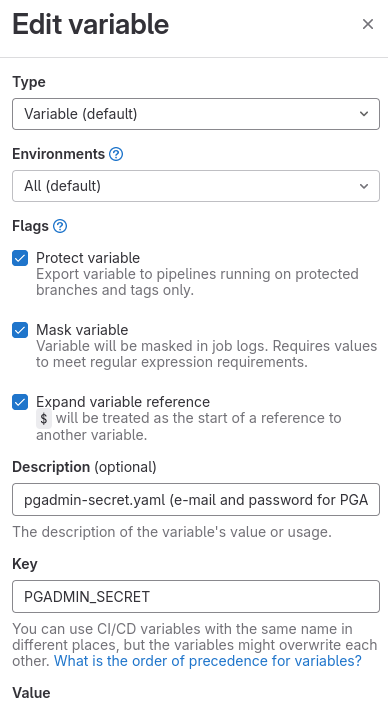 

</details>

Использование соответствующих переменных и создание секретов реализуем в stage create-secrets в .gitlab-ci.yml. 

<details>

<summary>подробнее</summary>

Переменные в GitLab: 

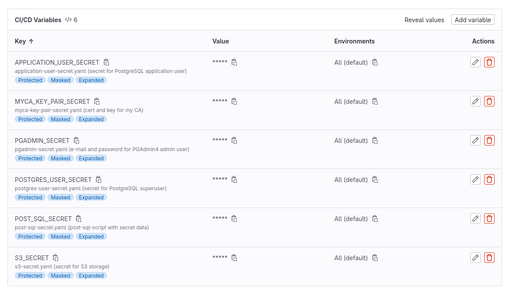 

Успешно выполненный [джоб create-secrets](https://gitlab.com/k8s-draft-kodmandvl/app/-/jobs/6591143670): 

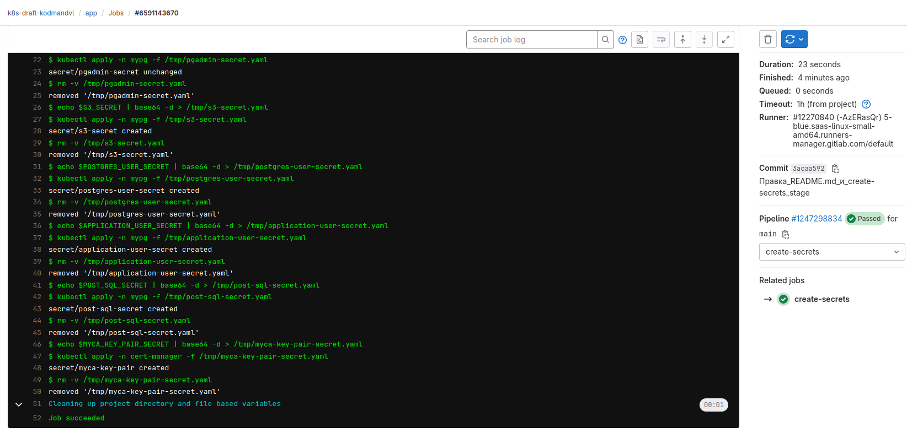 

Созданные секреты: 

```bash
$ kubectl get secrets -n mypg
NAME                      TYPE                       DATA   AGE
application-user-secret   kubernetes.io/basic-auth   2      8m40s
pgadmin-secret            Opaque                     2      40m
post-sql-secret           Opaque                     1      8m37s
postgres-user-secret      kubernetes.io/basic-auth   2      8m41s
s3-secret                 Opaque                     2      8m42s
$ kubectl get secrets -n cert-manager
NAME            TYPE     DATA   AGE
myca-key-pair   Opaque   2      8m40s
```

Успех! 

</details>

## Cert Manager

Для работы нашего приложения с SSL (TLS) нам понадобится Cert Manager (как для безопасной работы с БД, так и для обращения к нашим frontend-ам web и pgadmin по https). 

* Нужно добавить репозиторий, в котором хранится актуальный helm chart cert-manager: 

```bash
helm repo add jetstack https://charts.jetstack.io
helm repo list
helm repo update
```

* Также для установки cert-manager предварительно потребуется создать в кластере некоторые CRD ([ссылка](https://github.com/cert-manager/cert-manager/tree/master/deploy/charts/cert-manager) на документацию по установке): 

```bash
kubectl apply --validate=false -f https://github.com/jetstack/cert-manager/releases/download/v1.14.4/cert-manager.crds.yaml
```

* Установка cert-manager: 

```
helm search repo cert-manager
```

```bash
helm upgrade --install cert-manager jetstack/cert-manager --atomic \
--namespace=cert-manager --create-namespace --version=1.14.4
helm list -n cert-manager
kubectl get -n cert-manager secrets
kubectl get -n cert-manager all
```

* Создание ClusterIssuer-ов

Прежде всего нам необходимо создать свой ClusterIssuer для нашего CA (CluserIssuers acme просто оставил в маничесте на случай, если они когда-либо в будущем понадобятся, но на текущий момент они в нашем проекте не востребованы). 

* Указанные выше шаги добавим в [.gitlab-ci.yml](.gitlab-ci.yml) как stage cert-manager и stage clusterissuers. 

Cert Manager был успешно установлен в [джобе cert-manager](https://gitlab.com/k8s-draft-kodmandvl/app/-/jobs/6591487039): 

<details>

<summary>вывод джоба</summary>

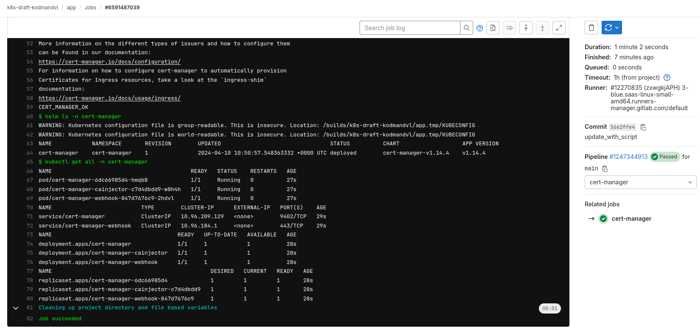 

</details>

ClusterIssuers были успешно созданы в [джобе clusterissuers](https://gitlab.com/k8s-draft-kodmandvl/app/-/jobs/6591487044): 

<details>

<summary>вывод джоба</summary>

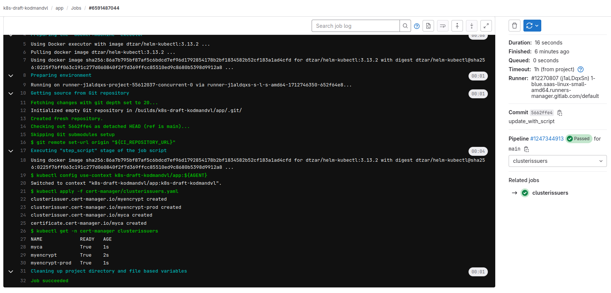 

Видим для ClusterIssuer myca, что READY => True. 

Наш ClusterIssuer myca успешно создан и готов к работе, он будет действовать от имени нашего CA. 

</details>

## Собственный CA

Как для безопасных коннектов к БД, так и для безопасного доступа к frontend-ам pgadmin и web нам нужно использовать SSL (TLS). 

Для этого у нас есть свой удостоверяющий центр сертификации myca (компания ["Damage, Inc."](https://www.metallica.com/songs/damage-inc.html)): 

```bash
$ openssl x509 -in tls.crt -text
Certificate:
    Data:
        ....................................................................................................
        Issuer: C = RU, ST = Lyubertsy, L = Lyubertsy, O = "Damage, Inc.", CN = myca
        Validity
            Not Before: Mar 30 15:11:41 2024 GMT
            Not After : Mar 30 15:11:41 2044 GMT
        Subject: C = RU, ST = Lyubertsy, L = Lyubertsy, O = "Damage, Inc.", CN = myca
        ....................................................................................................
```

Сертификат и ключ моего удостоверяющего центра сертификации (CA) были сгенерированы с помощью openssl: 

```bash
openssl genrsa -out tls.key 4096
openssl req -x509 -new -nodes -key tls.key -sha256 -days 7305 -out tls.crt
# (Subject: C = RU, ST = Lyubertsy, L = Lyubertsy, O = "Damage, Inc.", CN = myca)
# Show:
openssl x509 -in tls.crt -text
# For k8s secret:
cat tls.crt | base64 -w0
cat tls.key | base64 -w0
# Decode and show:
echo -n 'base64_cert' | base64 -d | openssl x509 -text
```

Далее с этим сертификатом и ключом был создан секрет myca-key-pair-secret в неймспейсе cert-manager (см. [выше](#secrets)) и соответствующий [ClusterIssuer myca](#cert-manager). 

## Выбор оператора

Провел анализ и исследование в поисках наиболее оптимального, подходящего нам оператора для работы с PostgreSQL в кластере Kubernetes. 

Изначально был наслышан об [операторе от компании Zalando](https://postgres-operator.readthedocs.io/en/latest/), хотел взять его и думал, что это лучший выбор (также попробовал с ним поразворачивать экземпляры). И он действительно очень хорош. 

Он очень известен и является, можно сказать, надстройкой над Patroni (инструмент для поддержания отказоустойчивого кластера PostgreSQL с автоматическим failover-ом и вообще с автоматизированным управлением кластером, тоже от компании Zalando). 

Но [проанализировав все известные операторы](https://habr.com/ru/companies/flant/articles/684202/) (а также попробовав из них Zalando и CNPG), остановился в итоге на операторе [CloudNative-PG (CNPG) от компании EDB](https://cloudnative-pg.io/). 

Этот оператор максимально удовлетворяет наши входящие требования: 

- автоматический failover
- удобство резервного копирования и восстановления
- встроенная удобная поддержка Prometheus
- кастомизация и удобство настройки (как docker-образа, так и самой СУБД)
- очень удобная и понятная документация
- и др.

_В итоге остановил свой выбор именно на CloudNative-PG (CNPG)._ 

Также отмечу здесь такие интересные особенности оператора CNPG: 

* если Patroni, управляя инстансами PostgreSQL, использует для хранения состояния инстансов и параметров какое-то отдельное хранилище (ETCD или т.п.), то оператор CNPG для хранения состояния инстансов использует само хранилище ETCD нашего кластера Kubernetes и использует CNPG контроллер.

* оператор CNPG использует такие CRD, как Cluster, Pooler (PGBouncer), ScheduledBackups и др.

* запускаются инстансы СУБД PostgreSQL оператором у нас как просто отдельные поды (с соответствующими метками, PVC и PV), для них не используются statefulset или deployment

* соответствующие сервисы стартуют вместе с кластером (хотя я и использовал дополнительно свои сервисы): сервис-rw на запись в основной инстанс, сервис-ro для чтения с инстансов-реплик, сервис-r просто для чтения с любых инстансов нашей HA-конфигурации.

Для установки оператора CNPG и всех CRD в [локальном черновике](local_draft/README.md) использовался [манифест cnpg версии 1.22.1 из репозитория проекта CNPG в GitHub](https://raw.githubusercontent.com/cloudnative-pg/cloudnative-pg/main/releases/cnpg-1.22.1.yaml). 

Но для большей управляемости, удобства и гибкости настройки я сделал на основе этого манифеста [свой Helm Chart](helm/cnpg/README.md) (см. [мои Helm Chart-ы](#свои-созданные-helm-chart-ы)). 

Установка оператора CNPG (как stage cnpg) добавлена в наш [.gitlab-ci.yml](.gitlab-ci.yml) (неймспейс cnpg-system для него мы уже ранее создали). 

[Джоб cnpg выполнился успешно](https://gitlab.com/k8s-draft-kodmandvl/app/-/jobs/6593848745): 

<details>

<summary>подробнее</summary>

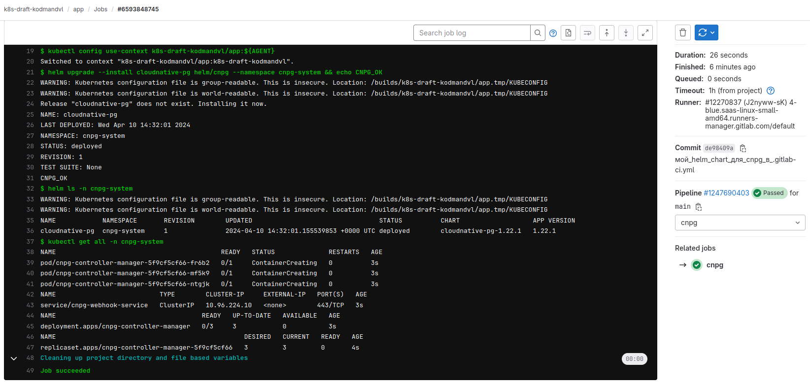 

Через некоторое время видим, что оператор готов к работе: 

```bash
$ kubectl get all -n cnpg-system 
NAME                                           READY   STATUS    RESTARTS   AGE
pod/cnpg-controller-manager-5f9cf5cf66-fr6b2   1/1     Running   0          4m1s
pod/cnpg-controller-manager-5f9cf5cf66-mf5k9   1/1     Running   0          4m1s
pod/cnpg-controller-manager-5f9cf5cf66-ntgjk   1/1     Running   0          4m1s

NAME                           TYPE        CLUSTER-IP     EXTERNAL-IP   PORT(S)   AGE
service/cnpg-webhook-service   ClusterIP   10.96.224.10   <none>        443/TCP   4m2s

NAME                                      READY   UP-TO-DATE   AVAILABLE   AGE
deployment.apps/cnpg-controller-manager   3/3     3            3           4m2s

NAME                                                 DESIRED   CURRENT   READY   AGE
replicaset.apps/cnpg-controller-manager-5f9cf5cf66   3         3         3       4m2s
```

Также видим три заявленные мной реплики cnpg-controller-manager-а. 

</details>

## Мониторинг, часть 1

Чтобы сразу при деплое нашего отказоустойчивого кластера PostgreSQL выбрать `enablePodMonitor: true` и всё подхватилось, мы развернём Prometheus и Grafana на этом шаге (т.е. до развёртывания нашего HA-кластера PostgreSQL). 

В [локальном черновике](local_draft/README.md) разворачивал Prometheus Operator [следующим образом](https://cloudnative-pg.io/documentation/1.22/quickstart/#part-4-monitor-clusters-with-prometheus-and-grafana): 

<details>

<summary>установка в Prometheus Operator в локальном черновике на Minikube</summary>

```bash
helm repo add prometheus-community \
  https://prometheus-community.github.io/helm-charts
helm repo update
helm repo ls
# Создаем новый NS и делаем его дефолтным:
kubectl apply -f mon-ns.yaml 
kubectl config set-context --current --namespace=mon
kubectl config get-contexts
wget https://raw.githubusercontent.com/cloudnative-pg/cloudnative-pg/main/docs/src/samples/monitoring/kube-stack-config.yaml 
helm upgrade --install \
     -f kube-stack-config.yaml \
     prometheus-community prometheus-community/kube-prometheus-stack \
     --namespace=mon
kubectl --namespace mon get pods -l "release=prometheus-community"
kubectl get crds
kubectl get svc
wget https://raw.githubusercontent.com/cloudnative-pg/cloudnative-pg/main/docs/src/samples/monitoring/prometheusrule.yaml
kubectl apply -f prometheusrule.yaml
kubectl apply -f prom-svc-lb.yaml
kubectl apply -f graf-svc-lb.yaml
kubectl get all
kubectl get svc
# Если бы не было MetalLB, то, например: you can port-forward: kubectl port-forward svc/prometheus-community-grafana 3000:80
# credentials: admin as username, prom-operator as password (defined in kube-stack-config.yaml)
# Prometheus: http://192.168.118.3:9090
# Grafana: http://192.168.118.4:3000
wget https://raw.githubusercontent.com/cloudnative-pg/charts/main/charts/cloudnative-pg/monitoring/grafana-dashboard.json
# And then import dashboard to Grafana
```

</details>

Добавил в .gitlab-ci.yml установку Prometheus Operator и манифест prometheusrule.yaml как stage prometheus-operator и prometheusrule, соответственно (неймспейс mon для него мы уже создали ранее). 

Джоб [prometheus-operator](https://gitlab.com/k8s-draft-kodmandvl/app/-/jobs/6597753402) и [prometheusrule](https://gitlab.com/k8s-draft-kodmandvl/app/-/jobs/6597753412) выполнились успешно. 

<details>

<summary>вывод джобов</summary>

* Prometheus-Operator:

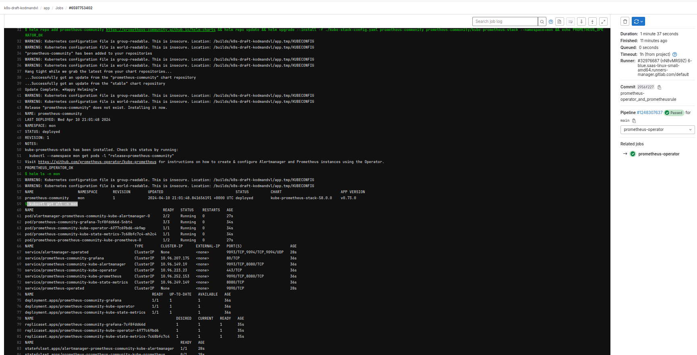 

* Prometheus Rule:

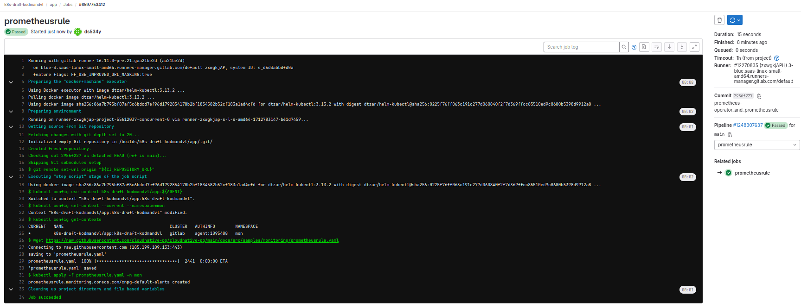 

</details>

А подробнее Prometheus и Grafana мы рассмотрим уже в разделе [Мониторинг, часть 2](#мониторинг-часть-2), когда будет что мониторить и визуализировать. 

## Свой образ и кастомизация

Подробности про системные требования к поддерживаемым образам и про мой кастомный docker-образ для нашего проекта описаны в [docker/README.md](docker/README.md). 

В DockerHub мой образ можно найти [здесь](https://hub.docker.com/r/kodmandvl/cnpg/tags), с ним и проводились локальные тесты в Minikube и затем пробы, исследования и тюнинг уже в черновом кластере на Yandex Cloud. 

Для нашего чистового проекта я [собрал его и в GitLab](https://gitlab.com/k8s-draft-kodmandvl/app/-/jobs/6576349765) (stage build в .gitlab-ci.yml). 

<details>

<summary>Образы в Container Registry GitLab</summary>

Этот и другие собранные образы (имя образов - app и разные теги): 

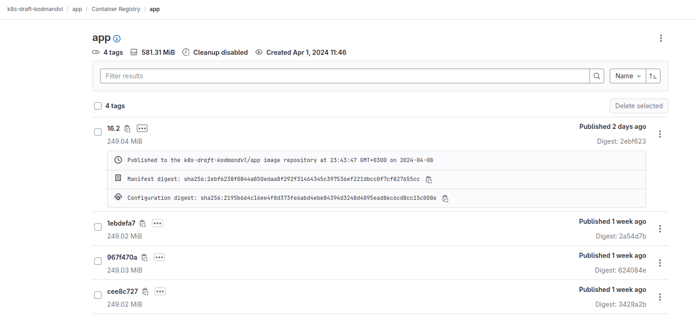 

Соответственно, в Docker-е можно запустить мой кастомный образ не только из docker.io/kodmandvl/cnpg, но и из registry.gitlab.com/k8s-draft-kodmandvl/app: 

```bash
$ docker pull registry.gitlab.com/k8s-draft-kodmandvl/app:16.2
16.2: Pulling from k8s-draft-kodmandvl/app
Digest: sha256:2ebf6238f0844a850edaa8f292f31464345c397536ef221dbcc0f7cf827655cc
Status: Image is up to date for registry.gitlab.com/k8s-draft-kodmandvl/app:16.2
registry.gitlab.com/k8s-draft-kodmandvl/app:16.2
```

</details>

## Локальные исследования и тюнинг

Локальные исследования, анализ, пробы, тюнинг, улучшение и постепенное погружение в детали выполнялись в Minikube, подробности описаны в [local_draft/README.md](local_draft/README.md), все материалы и отдельные манифесты находятся в [local_draft/](local_draft/) и соответствующих поддиректориях. 

Там в т.ч. выполнялась настройка и улучшение кластера, проверялись бэкапы, проводилось восстановление из бэкапа в новый кластер, наполнение БД тестовыми данными, нагрузка с помощью PGBench напрямую в БД и через Pooler (PGBouncer) и многое другое (всё описано в README.md для local_draft). 

## Свои созданные Helm Chart-ы

Для работы нашего приложения и его окружения в локальном черновике на Minikube исследовались, разрабтывались и проверялись мной разрозненные отдельные манифесты. 

А для автоматизированной, гибкой, управляемой раскатки данных приложений уже в нашем многоузловом продакшен кластере я шаблонизировал и улучшил разрозненные манифесты из local_draft и разработал следующие Helm Chart-ы: 

- CNPG (собственно, сам оператор CloudNative-PG, в моем чарте параметризировано количество реплик запускаемого cnpg-controller-manager-а и используемый неймспейс)
- MyPG (мой Helm Chart для деплоя кластера CNPG)
- Pooler (мой Helm Chart для развёртывания pooler-а, т.е. PGBouncer-а, под наш кластер CNPG)
- MyNginx (мой Helm Chart для развёртывания моего [легковесного Nginx](https://hub.docker.com/r/kodmandvl/mynginx/tags), который я сделал стартовой страницей своего проекта) 
- pgAdmin (мой Helm Chart для развёртывания statefulset-а с приложением pgAdmin4 для работы с нашим кластером CNPG)

Стоит отметить, что `Cluster`, `Pooler`, `Backup` и `ScheduledBackup` - это созданные CRD для оператора CNPG. 

Для быстрой проверки работы кластера CNPG при первой установке кластера (чарт mypg) можно выбрать false для всех булевых values в чарте mypg (автозаменой true на false), что позволит быстро запустить кластер просто для проверки и первого знакомства (а также это избавит от необходимости подготовки собственных сертификатов, конфигмапов, секретов, хранилища S3, мониторинга и т.д., т.е. простейший кластер для проверки и занкомства). 

Установку чарта CNPG мы уже рассмотрели выше в разделе [Выбор оператора](#выбор-оператора). 

Здесь рассмотрим остальные 4 моих чарта. 

* **Helm Chart MyPG**

`MyPG` - чарт для развёртывания кластера PostgreSQL под управлением оператора CNPG. 

В локальных тестах это были отдельные манифесты и отдельные варианты, в которых я пробовал и исследовал разные возможности и выполнял тюнинг. 

А в данном случае (с теми values, которые входят в поставку) мы получаем: 

- отказоустойчивый кластер PostgreSQL mypg-yc из двух инстансов (лидер и реплика, можно увеличить число инстансов в values, а также можно уменьшить число инстансов до одного, если реплики не нужны)
- в values используется наш кастомный образ registry.gitlab.com/k8s-draft-kodmandvl/app:16.2
- помимо стандартных сервисов rw, ro и r, создается сервис mypg-yc-svc-lb типа LoadBalancer для rw
- создается подключение к объектному хранилищу S3 для бэкапов БД и журналов WAL (файлы WAL отправляются туда раз в 5 минут)
- создается расписание для регулярных бэкапов БД (в отличие от обычного крона, там 6 полей, самое левое поле - секунды)
- разрешается обнаружение для мониторинга
- настраивается для подключение инстансов-реплик и вообще для части прикладных учёток использование сертификатов нашего CA (можно использовать сертификаты, которые оператор сгенерирует сам, а можно с собственным CA, а у нас есть собственный CA)
- выполняется тюнинг параметров PostgreSQL под сайзинг наших воркернод в Kubernetes
- выполняется наша конфигурация правил аутентификации пользователей БД (правила HBA)
- создаются необходимые расширения и объекты (в т.ч. таблица с историей суммарного размера баз инстанса, обновляющаяся раз в минуту по pg_cron)
- и др.

Развёртывание кластера добавлено в .gitlab-ci.yml как stage mypg. 

<details>

<summary>подробности</summary>

Отмечу, что все предварительные подготовки мы выполнили ранее (создание нашего ClusterIssuer с нашим CA, создание неймспейса mypg, создание необходимых секретов, установка оператора CNPG), поэтому сейчас нам остается только запустить установку чарта: 

```bash
helm upgrade --install mypg helm/mypg --namespace mypg
```

Также необходимо отметить, что перед полной переустановкой чарта (например, если были выбраны какие-то некорректные values или еще по какой-то причине) нужно удостовериться, что удалены соответствующие `PVC` для инстансов, иначе после инсталляции инициализация БД завершится ошибкой. 

[Джоб mypg выполнился успешно](https://gitlab.com/k8s-draft-kodmandvl/app/-/jobs/6601511746): 


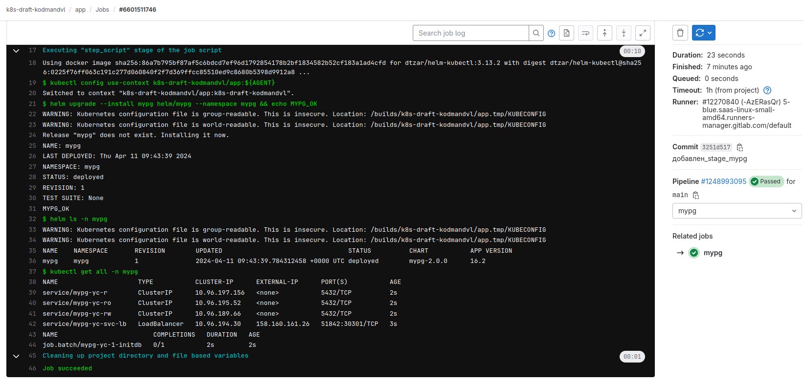 

Через некоторое время после установки наблюдаем, что инициализация инстанса завершена, он успешно работает (pod/mypg-yc-1), также через некоторое время инициализируется и начинает работать реплика (pod/mypg-yc-2): 

```bash
$ kubectl get all -n mypg
NAME            READY   STATUS    RESTARTS   AGE
pod/mypg-yc-1   1/1     Running   0          9m45s
pod/mypg-yc-2   1/1     Running   0          7m55s

NAME                     TYPE           CLUSTER-IP      EXTERNAL-IP      PORT(S)           AGE
service/mypg-yc-r        ClusterIP      10.96.197.156   <none>           5432/TCP          10m
service/mypg-yc-ro       ClusterIP      10.96.195.52    <none>           5432/TCP          10m
service/mypg-yc-rw       ClusterIP      10.96.189.66    <none>           5432/TCP          10m
service/mypg-yc-svc-lb   LoadBalancer   10.96.194.30    158.160.161.26   51842:30301/TCP   10m
```

Запомним наш внешний адрес LoadBalancer (`158.160.161.26`) для внешнего подключения к БД и сделаем его статическим и защищённым от удаления в Yandex Cloud. 

Отметим, что из интернета подключение к БД, конечно же, не должно быть разрешено (здесь сделаем скидку на наш проект). 

Но у нас подключение к БД из интеренета возможно (к LoadBalancer по порту 51842): 

- для пользователей myappuser, postgres и streaming_replica - только по сертификату с проверкой подлинности
- для пользователей myappuser2 и reader - по паролю. 

В случае необходимости можно поправить values и обновить чарт так, чтобы сервис LoadBalancer не использовался и кластер PostgreSQL был доступен только во внутреннем контуре. 

Подключимся к БД и посмотрим. 

Сначала подключимся удалённо и проверим подключение по SSL, посмотрим имеющиеся подключения по SSL, а также заглянем в таблицу size_hist, которая у нас наполняется по pg_cron-у: 

```bash
$ export PGUSER=postgres
$ export PGSSLCERT=postgres.crt
$ export PGSSLKEY=postgres.key
$ export PGSSLROOTCERT=tls.crt
$ psql 'host=158.160.161.26.nip.io port=51842 dbname=myappdb sslmode=verify-ca user=postgres'
psql (15.5 (Debian 15.5-1.pgdg110+1), сервер 16.2 (Debian 16.2-1.pgdg110+2))
SSL-соединение (протокол: TLSv1.3, шифр: TLS_AES_256_GCM_SHA384, сжатие: выкл.)
Введите "help", чтобы получить справку.

postgres@158.160.161.26.nip.io:51842/myappdb=# SELECT datname, usename, ssl, client_addr, client_dn, issuer_dn FROM pg_stat_ssl JOIN pg_stat_activity ON pg_stat_ssl.pid = pg_stat_activity.pid where ssl=true order by 3 desc, 1, 2, 4;
 datname |      usename      | ssl | client_addr |       client_dn       |                       issuer_dn                        
---------+-------------------+-----+-------------+-----------------------+--------------------------------------------------------
 myappdb | postgres          | t   | 10.1.0.11   | /CN=postgres          | /C=RU/ST=Lyubertsy/L=Lyubertsy/O=Damage\, Inc./CN=myca
         | streaming_replica | t   | 10.1.0.3    | /CN=streaming_replica | /C=RU/ST=Lyubertsy/L=Lyubertsy/O=Damage\, Inc./CN=myca
(2 строки)

postgres@158.160.161.26.nip.io:51842/myappdb=# select * from size_hist order by select_time desc limit 5;
          select_time          |   size   | size_pretty | cluster_name | ip | port 
-------------------------------+----------+-------------+--------------+----+------
 2024-04-11 13:15:00.03761+03  | 31291320 | 30 MB       | mypg-yc      |    |     
 2024-04-11 13:14:00.025011+03 | 31283128 | 30 MB       | mypg-yc      |    |     
 2024-04-11 13:13:00.035175+03 | 31283128 | 30 MB       | mypg-yc      |    |     
 2024-04-11 13:12:00.046249+03 | 31283128 | 30 MB       | mypg-yc      |    |     
 2024-04-11 13:11:00.357457+03 | 31274936 | 30 MB       | mypg-yc      |    |     
(5 строк)
```

Как видим, наша табличка дополняется раз в минуту, как и задумывалось. 

Также видим свой коннект по SSL и коннект к лидеру от реплики (обратите внимание на поле issuer_dn). 

Подключимся к БД локально прямо с пода. 

Зайдем на под с инстансом-лидером, посмотрим в нашу табличку, проверим роль инстанса и подключения по SSL (с помощью моих удобных алиасов role и ssl из файла .psqlrc): 

```bash
$ kubectl exec -it pods/mypg-yc-1 -- bash
Defaulted container "postgres" out of: postgres, bootstrap-controller (init)
[mypg-yc-1:/]$ psql
psql (16.2 (Debian 16.2-1.pgdg110+2))
Type "help" for help.

postgres@[local:/controller/run]:5432/postgres=# :ssl
 datname |      usename      | ssl | client_addr |       client_dn       |                       issuer_dn                        
---------+-------------------+-----+-------------+-----------------------+--------------------------------------------------------
         | streaming_replica | t   | 10.1.0.3    | /CN=streaming_replica | /C=RU/ST=Lyubertsy/L=Lyubertsy/O=Damage\, Inc./CN=myca
(1 row)

postgres@[local:/controller/run]:5432/postgres=# :now
              now              
-------------------------------
 2024-04-11 14:44:56.994856+03
(1 row)

postgres@[local:/controller/run]:5432/postgres=# \c myappdb 
You are now connected to database "myappdb" as user "postgres".
postgres@[local:/controller/run]:5432/myappdb=# select * from size_hist order by select_time desc limit 5;
          select_time          |   size   | size_pretty | cluster_name | ip | port 
-------------------------------+----------+-------------+--------------+----+------
 2024-04-11 14:45:00.038589+03 | 31537080 | 30 MB       | mypg-yc      |    |     
 2024-04-11 14:44:00.034664+03 | 31528888 | 30 MB       | mypg-yc      |    |     
 2024-04-11 14:43:00.043954+03 | 31528888 | 30 MB       | mypg-yc      |    |     
 2024-04-11 14:42:00.260317+03 | 31528888 | 30 MB       | mypg-yc      |    |     
 2024-04-11 14:41:00.046292+03 | 31520696 | 30 MB       | mypg-yc      |    |     
(5 rows)

postgres@[local:/controller/run]:5432/myappdb=# :role
  role  
--------
 LEADER
(1 row)
```

Посмотрим сертификаты на поде: 

```bash
$ kubectl exec -it pods/mypg-yc-1 -- bash
Defaulted container "postgres" out of: postgres, bootstrap-controller (init)
[mypg-yc-1:/]$ cd /controller/certificates/
[mypg-yc-1:certificates]$ ls
client-ca.crt  server-ca.crt  server.crt  server.key  streaming_replica.crt  streaming_replica.key
[mypg-yc-1:certificates]$ openssl x509 -in server.crt -text
Certificate:
    Data:
....................................................................................................
        Signature Algorithm: sha256WithRSAEncryption
        Issuer: C = RU, ST = Lyubertsy, L = Lyubertsy, O = "Damage, Inc.", CN = myca
        Validity
            Not Before: Apr 11 09:43:44 2024 GMT
            Not After : Jul 10 09:43:44 2024 GMT
        Subject: 
        Subject Public Key Info:
            Public Key Algorithm: rsaEncryption
                RSA Public-Key: (2048 bit)
....................................................................................................
            X509v3 Subject Alternative Name: critical
                DNS:mypg-yc-svc-lb, DNS:mypg-yc-svc-lb.mypg, DNS:mypg-yc-svc-lb.mypg.svc, DNS:mypg-yc-svc-lb.mypg.svc.cluster.local, DNS:mypg-yc-rw, DNS:mypg-yc-rw.mypg, DNS:mypg-yc-rw.mypg.svc, DNS:mypg-yc-rw.mypg.svc.cluster.local, DNS:mypg-yc-r, DNS:mypg-yc-r.mypg, DNS:mypg-yc-r.mypg.svc, DNS:mypg-yc-r.mypg.svc.cluster.local, DNS:mypg-yc-ro, DNS:mypg-yc-ro.mypg, DNS:mypg-yc-ro.mypg.svc, DNS:mypg-yc-ro.mypg.svc.cluster.local
    Signature Algorithm: sha256WithRSAEncryption
....................................................................................................
```

</details>

* **Helm Chart Pooler**

Развёртывание пулера в локальном черновике выполнялась применением отдельных манифестов (в app/local_draft/mypg). 

Для большей управляемости и гибкости я преобразил эти отдельные манифесты в Helm-чарт. 

В случае нашего полноценного продакшен кластера Kubernetes у нас на одном из воркернод находится инстанс СУБД, лидер, работающий на запись, и инстанс-реплика в read only. 

Наличие нескольких реплик Pooler-а (в нашем случае в values я задал 3) решает несколько задач: 

- рациональное потребление CPU и RAM (есть пул сессий, физически выделяется меньше сессий, чем запрашивается в приложении)
- возможность подключения большего количества сессий, чем задано в max_connections, благодаря пулу сессий
- благодаря деплойменту Pooler-а с несколькми репликами получаем также и балансировку нагрузки между несколькими рабочими узлами

<details>

<summary>подробности</summary>

В примере в [локальном черновике](local_draft/README.md) в PGBench запускал нагрузку в 700 клиентов (-c700), хотя max_connections в PostgreSQL у нас задано 500. 

А реальных коннектов в СУБД у нас значительно меньше, т.к.: 

- pool_mode = transaction, поэтому после транзакции подключение освобождается и отдается обратно в pool
- default_pool_size у нас задан 150, поэтому сессий используется порядка 450 при такой нагрузке от PGBench при наличии трех реплик Pooler-а

А вот если бы мы с max_connections = 500 попробовали бы подключить к нашему PostgreSQL 700 клиентов от PGBench напрямую к самому сервису PostgreSQL, такой тест бы не удался. 

Необходимые параметры я рассчитал и прописал в values. 

Нагрузку PGBench через Pooler на нашем продакшен кластере мы еще позапускаем в разделе [Мониторинг, часть 2](#мониторинг-часть-2), а также проверим коннект через Pooler из приложения PGAdmin4 (когда он будет установлен). 

Установка (при наличии уже созданного ClusterIssuer myca, неймспейса mypg, кластера mypg-yc): 

```bash
helm upgrade --install pooler helm/pooler --namespace mypg
```

Так же, как и в случае установки кластера, если в values для всех булевых значениq для Pooler-а выставить false (автозаменой true на false), то можно получить простую инсталляцию Pooler для знакомства и работы с ним (главное, что если используется собственный CA в кластере, то и в пулере тоже должен, иначе пулер не будет работать). 

Установка Pooler добавлена в .gitlab-ci.yml как stage pooler, установка [прошла успешно](https://gitlab.com/k8s-draft-kodmandvl/app/-/jobs/6604344586): 

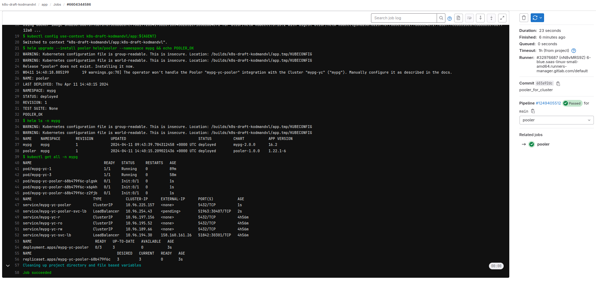 

Через некоторое время Pooler полностью готов к работе. 

Подключаемся через Pooler к БД (несколько раз, чтобы все три реплики пулера поключились) и видим, что коннект действительно идет через Pooler (пользователь cnpg_pooler_pgbouncer, три пула по 15 коннектов, min_pool_size): 

```bash
$ kubectl get all
NAME                                 READY   STATUS    RESTARTS   AGE
pod/mypg-yc-1                        1/1     Running   0          108m
pod/mypg-yc-3                        1/1     Running   0          77m
pod/mypg-yc-pooler-68b479f6c-plgsk   1/1     Running   0          19m
pod/mypg-yc-pooler-68b479f6c-x6pkh   1/1     Running   0          19m
pod/mypg-yc-pooler-68b479f6c-z2fjb   1/1     Running   0          19m

NAME                            TYPE           CLUSTER-IP      EXTERNAL-IP      PORT(S)           AGE
service/mypg-yc-pooler          ClusterIP      10.96.225.157   <none>           5432/TCP          19m
service/mypg-yc-pooler-svc-lb   LoadBalancer   10.96.254.43    158.160.160.84   51963:30407/TCP   19m
service/mypg-yc-r               ClusterIP      10.96.197.156   <none>           5432/TCP          5h15m
service/mypg-yc-ro              ClusterIP      10.96.195.52    <none>           5432/TCP          5h15m
service/mypg-yc-rw              ClusterIP      10.96.189.66    <none>           5432/TCP          5h15m
service/mypg-yc-svc-lb          LoadBalancer   10.96.194.30    158.160.161.26   51842:30301/TCP   5h15m

NAME                             READY   UP-TO-DATE   AVAILABLE   AGE
deployment.apps/mypg-yc-pooler   3/3     3            3           19m

NAME                                       DESIRED   CURRENT   READY   AGE
replicaset.apps/mypg-yc-pooler-68b479f6c   3         3         3       19m
$ psql 'host=158.160.160.84.nip.io port=51963 dbname=myappdb user=myappuser2'
psql (15.5 (Debian 15.5-1.pgdg110+1), сервер 16.2 (Debian 16.2-1.pgdg110+2))
ПРЕДУПРЕЖДЕНИЕ: psql имеет базовую версию 15, а сервер - 16.
                Часть функций psql может не работать.
SSL-соединение (протокол: TLSv1.3, шифр: TLS_AES_256_GCM_SHA384, сжатие: выкл.)
Введите "help", чтобы получить справку.

myappuser2@158.160.160.84.nip.io:51963/myappdb=> select * from size_hist order by select_time desc limit 5;
          select_time          |   size   | size_pretty | cluster_name | ip | port 
-------------------------------+----------+-------------+--------------+----+------
 2024-04-11 17:59:00.030182+03 | 31864760 | 30 MB       | mypg-yc      |    |     
 2024-04-11 17:58:00.025942+03 | 31864760 | 30 MB       | mypg-yc      |    |     
 2024-04-11 17:57:00.046602+03 | 31864760 | 30 MB       | mypg-yc      |    |     
 2024-04-11 17:56:00.024622+03 | 31864760 | 30 MB       | mypg-yc      |    |     
 2024-04-11 17:55:00.030364+03 | 31864760 | 30 MB       | mypg-yc      |    |     
(5 строк)

myappuser2@158.160.160.84.nip.io:51963/myappdb=> :ssl13
 datname |  usename   | ssl |  client_addr  |         client_dn         |                       issuer_dn                        
---------+------------+-----+---------------+---------------------------+--------------------------------------------------------
 myappdb | myappuser2 | t   | 10.1.0.11     | /CN=cnpg_pooler_pgbouncer | /C=RU/ST=Lyubertsy/L=Lyubertsy/O=Damage\, Inc./CN=myca
 myappdb | myappuser2 | t   | 10.1.0.11     | /CN=cnpg_pooler_pgbouncer | /C=RU/ST=Lyubertsy/L=Lyubertsy/O=Damage\, Inc./CN=myca
 myappdb | myappuser2 | t   | 10.1.0.11     | /CN=cnpg_pooler_pgbouncer | /C=RU/ST=Lyubertsy/L=Lyubertsy/O=Damage\, Inc./CN=myca
 myappdb | myappuser2 | t   | 10.1.0.11     | /CN=cnpg_pooler_pgbouncer | /C=RU/ST=Lyubertsy/L=Lyubertsy/O=Damage\, Inc./CN=myca
 myappdb | myappuser2 | t   | 10.1.0.11     | /CN=cnpg_pooler_pgbouncer | /C=RU/ST=Lyubertsy/L=Lyubertsy/O=Damage\, Inc./CN=myca
 myappdb | myappuser2 | t   | 10.1.0.11     | /CN=cnpg_pooler_pgbouncer | /C=RU/ST=Lyubertsy/L=Lyubertsy/O=Damage\, Inc./CN=myca
 myappdb | myappuser2 | t   | 10.1.0.11     | /CN=cnpg_pooler_pgbouncer | /C=RU/ST=Lyubertsy/L=Lyubertsy/O=Damage\, Inc./CN=myca
 myappdb | myappuser2 | t   | 10.1.0.11     | /CN=cnpg_pooler_pgbouncer | /C=RU/ST=Lyubertsy/L=Lyubertsy/O=Damage\, Inc./CN=myca
 myappdb | myappuser2 | t   | 10.1.0.11     | /CN=cnpg_pooler_pgbouncer | /C=RU/ST=Lyubertsy/L=Lyubertsy/O=Damage\, Inc./CN=myca
 myappdb | myappuser2 | t   | 10.1.0.11     | /CN=cnpg_pooler_pgbouncer | /C=RU/ST=Lyubertsy/L=Lyubertsy/O=Damage\, Inc./CN=myca
 myappdb | myappuser2 | t   | 10.1.0.11     | /CN=cnpg_pooler_pgbouncer | /C=RU/ST=Lyubertsy/L=Lyubertsy/O=Damage\, Inc./CN=myca
 myappdb | myappuser2 | t   | 10.1.0.11     | /CN=cnpg_pooler_pgbouncer | /C=RU/ST=Lyubertsy/L=Lyubertsy/O=Damage\, Inc./CN=myca
 myappdb | myappuser2 | t   | 10.1.0.11     | /CN=cnpg_pooler_pgbouncer | /C=RU/ST=Lyubertsy/L=Lyubertsy/O=Damage\, Inc./CN=myca
 myappdb | myappuser2 | t   | 10.1.0.11     | /CN=cnpg_pooler_pgbouncer | /C=RU/ST=Lyubertsy/L=Lyubertsy/O=Damage\, Inc./CN=myca
 myappdb | myappuser2 | t   | 10.1.0.11     | /CN=cnpg_pooler_pgbouncer | /C=RU/ST=Lyubertsy/L=Lyubertsy/O=Damage\, Inc./CN=myca
 myappdb | myappuser2 | t   | 10.1.0.28     | /CN=cnpg_pooler_pgbouncer | /C=RU/ST=Lyubertsy/L=Lyubertsy/O=Damage\, Inc./CN=myca
 myappdb | myappuser2 | t   | 10.1.0.28     | /CN=cnpg_pooler_pgbouncer | /C=RU/ST=Lyubertsy/L=Lyubertsy/O=Damage\, Inc./CN=myca
 myappdb | myappuser2 | t   | 10.1.0.28     | /CN=cnpg_pooler_pgbouncer | /C=RU/ST=Lyubertsy/L=Lyubertsy/O=Damage\, Inc./CN=myca
 myappdb | myappuser2 | t   | 10.1.0.28     | /CN=cnpg_pooler_pgbouncer | /C=RU/ST=Lyubertsy/L=Lyubertsy/O=Damage\, Inc./CN=myca
 myappdb | myappuser2 | t   | 10.1.0.28     | /CN=cnpg_pooler_pgbouncer | /C=RU/ST=Lyubertsy/L=Lyubertsy/O=Damage\, Inc./CN=myca
 myappdb | myappuser2 | t   | 10.1.0.28     | /CN=cnpg_pooler_pgbouncer | /C=RU/ST=Lyubertsy/L=Lyubertsy/O=Damage\, Inc./CN=myca
 myappdb | myappuser2 | t   | 10.1.0.28     | /CN=cnpg_pooler_pgbouncer | /C=RU/ST=Lyubertsy/L=Lyubertsy/O=Damage\, Inc./CN=myca
 myappdb | myappuser2 | t   | 10.1.0.28     | /CN=cnpg_pooler_pgbouncer | /C=RU/ST=Lyubertsy/L=Lyubertsy/O=Damage\, Inc./CN=myca
 myappdb | myappuser2 | t   | 10.1.0.28     | /CN=cnpg_pooler_pgbouncer | /C=RU/ST=Lyubertsy/L=Lyubertsy/O=Damage\, Inc./CN=myca
 myappdb | myappuser2 | t   | 10.1.0.28     | /CN=cnpg_pooler_pgbouncer | /C=RU/ST=Lyubertsy/L=Lyubertsy/O=Damage\, Inc./CN=myca
 myappdb | myappuser2 | t   | 10.1.0.28     | /CN=cnpg_pooler_pgbouncer | /C=RU/ST=Lyubertsy/L=Lyubertsy/O=Damage\, Inc./CN=myca
 myappdb | myappuser2 | t   | 10.1.0.28     | /CN=cnpg_pooler_pgbouncer | /C=RU/ST=Lyubertsy/L=Lyubertsy/O=Damage\, Inc./CN=myca
 myappdb | myappuser2 | t   | 10.1.0.28     | /CN=cnpg_pooler_pgbouncer | /C=RU/ST=Lyubertsy/L=Lyubertsy/O=Damage\, Inc./CN=myca
 myappdb | myappuser2 | t   | 10.1.0.28     | /CN=cnpg_pooler_pgbouncer | /C=RU/ST=Lyubertsy/L=Lyubertsy/O=Damage\, Inc./CN=myca
 myappdb | myappuser2 | t   | 10.1.0.28     | /CN=cnpg_pooler_pgbouncer | /C=RU/ST=Lyubertsy/L=Lyubertsy/O=Damage\, Inc./CN=myca
 myappdb | myappuser2 | t   | 10.112.130.25 | /CN=cnpg_pooler_pgbouncer | /C=RU/ST=Lyubertsy/L=Lyubertsy/O=Damage\, Inc./CN=myca
 myappdb | myappuser2 | t   | 10.112.130.25 | /CN=cnpg_pooler_pgbouncer | /C=RU/ST=Lyubertsy/L=Lyubertsy/O=Damage\, Inc./CN=myca
 myappdb | myappuser2 | t   | 10.112.130.25 | /CN=cnpg_pooler_pgbouncer | /C=RU/ST=Lyubertsy/L=Lyubertsy/O=Damage\, Inc./CN=myca
 myappdb | myappuser2 | t   | 10.112.130.25 | /CN=cnpg_pooler_pgbouncer | /C=RU/ST=Lyubertsy/L=Lyubertsy/O=Damage\, Inc./CN=myca
 myappdb | myappuser2 | t   | 10.112.130.25 | /CN=cnpg_pooler_pgbouncer | /C=RU/ST=Lyubertsy/L=Lyubertsy/O=Damage\, Inc./CN=myca
 myappdb | myappuser2 | t   | 10.112.130.25 | /CN=cnpg_pooler_pgbouncer | /C=RU/ST=Lyubertsy/L=Lyubertsy/O=Damage\, Inc./CN=myca
 myappdb | myappuser2 | t   | 10.112.130.25 | /CN=cnpg_pooler_pgbouncer | /C=RU/ST=Lyubertsy/L=Lyubertsy/O=Damage\, Inc./CN=myca
 myappdb | myappuser2 | t   | 10.112.130.25 | /CN=cnpg_pooler_pgbouncer | /C=RU/ST=Lyubertsy/L=Lyubertsy/O=Damage\, Inc./CN=myca
 myappdb | myappuser2 | t   | 10.112.130.25 | /CN=cnpg_pooler_pgbouncer | /C=RU/ST=Lyubertsy/L=Lyubertsy/O=Damage\, Inc./CN=myca
 myappdb | myappuser2 | t   | 10.112.130.25 | /CN=cnpg_pooler_pgbouncer | /C=RU/ST=Lyubertsy/L=Lyubertsy/O=Damage\, Inc./CN=myca
 myappdb | myappuser2 | t   | 10.112.130.25 | /CN=cnpg_pooler_pgbouncer | /C=RU/ST=Lyubertsy/L=Lyubertsy/O=Damage\, Inc./CN=myca
 myappdb | myappuser2 | t   | 10.112.130.25 | /CN=cnpg_pooler_pgbouncer | /C=RU/ST=Lyubertsy/L=Lyubertsy/O=Damage\, Inc./CN=myca
 myappdb | myappuser2 | t   | 10.112.130.25 | /CN=cnpg_pooler_pgbouncer | /C=RU/ST=Lyubertsy/L=Lyubertsy/O=Damage\, Inc./CN=myca
 myappdb | myappuser2 | t   | 10.112.130.25 | /CN=cnpg_pooler_pgbouncer | /C=RU/ST=Lyubertsy/L=Lyubertsy/O=Damage\, Inc./CN=myca
 myappdb | myappuser2 | t   | 10.112.130.25 | /CN=cnpg_pooler_pgbouncer | /C=RU/ST=Lyubertsy/L=Lyubertsy/O=Damage\, Inc./CN=myca
(45 строк)
```

Для внешнего IP-адреса LoadBalancer-а Pooler-а `158.160.160.84` также включаем статику и защиту от удаления в Yandex Cloud. 

</details>

* **Helm Chart MyNginx**

Изначально в локальном черновике использовал [свой образ Nginx](https://hub.docker.com/r/kodmandvl/mynginx/tags) просто для проверки кластера Kubernetes, Ingress-Nginx и LoadBalancer-а. 

Но уже в продакшен кластере я подменил command и args и сделал свой небольшой Helm Chart для деплоя приветственной домашней страницы своего проекта. 

<details>

<summary>подробности</summary>

В values нужно записать корректные адреса LoadBalancer-ов для Ingress-Nginx Controller-а, PostgreSQL Cluster-а и Pooler-а. 

Этот шаг добавлен в .gitlab-ci.yml как stage mynginx. 

Также в рамках этого шага для Ingress-Nginx Controller-а выставляется в качестве дефолтного наш сертификат webcert, созданнный для Ingress-ов моего MyNginx и подписанный моим CA myca. 

Джоб установки MyNginx [выполнился успешно](https://gitlab.com/k8s-draft-kodmandvl/app/-/jobs/6605191898): 

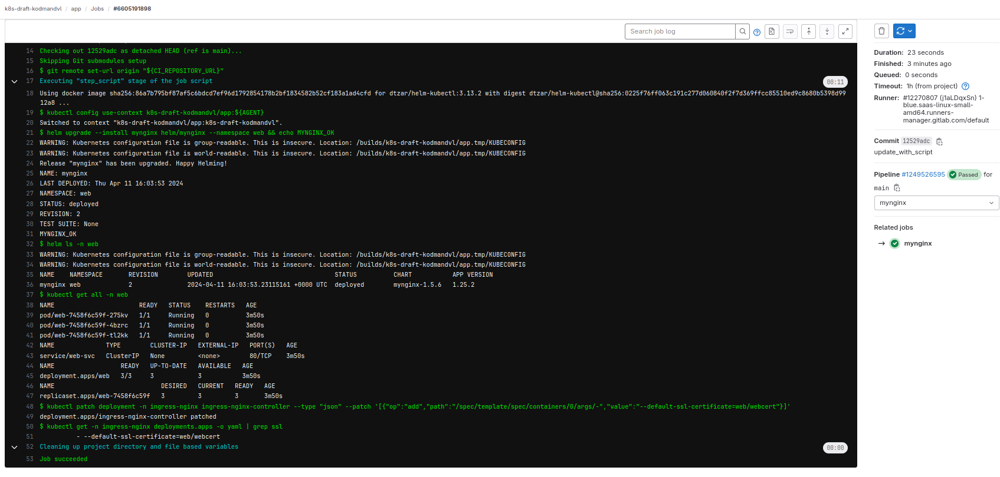 

Теперь по адресам https://web.158.160.150.250.nip.io/ , https://158.160.150.250.nip.io/web/ и https://158.160.150.250/web/ мы можем открыть приветственную страницу нашего проекта: 

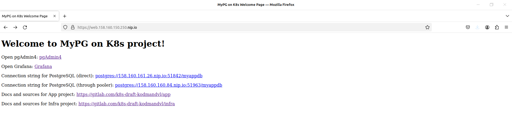 

Сертификат моего CA я добавил в доверенные, поэтому соединение считается защищенным: 

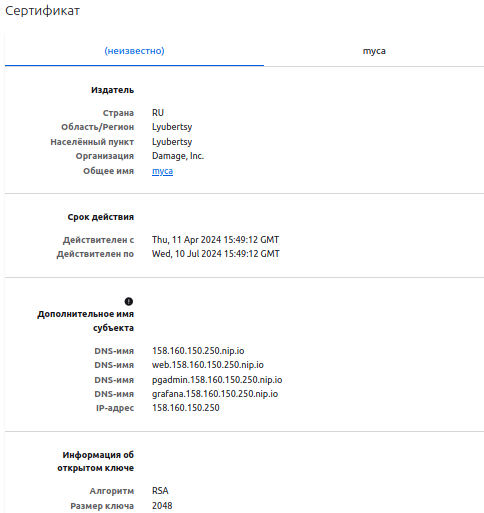 

</details>

* **Helm Chart pgAdmin**

Для установки pgAdmin4 разработал такой Helm Chart. 

Получаем на выходе stateful приложение pgAdmin4 со следующими особенностями: 

- изначально при первом запуске импортируется набор серверов из двух подключений через Pooler (как пользователь myappuser2 с именем коннекта "application" и как пользователь reader на чтение с именем коннекта "read-only")
- далее настройки сохраняются и приложение работает, сохраняя состояние, в т.ч. другие коннекты в списке, новых созданных пользователей приложения pgAdmin4
- создается Ingress для приложения pgAdmin4

Установка pgAdmin4 добавлена в .gitlab-ci.yml как stage pgadmin. 

<details>

<summary>подробности</summary>

В values важно прописать корректный внешний IP-адрес LoadBalancer-а Ingress-Nginx Controller-а (или переопределить при запуске Helm). 

Установка pgAdmin [прошла успешно](https://gitlab.com/k8s-draft-kodmandvl/app/-/jobs/6607040372): 

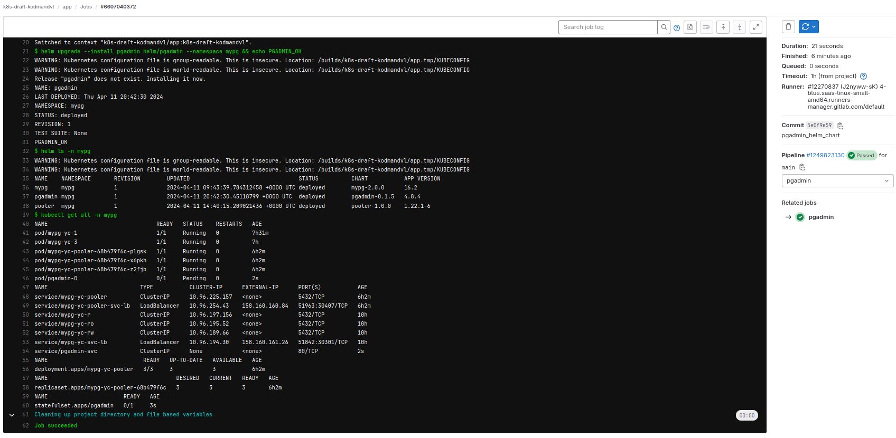 

Теперь по адресам https://pgadmin.158.160.150.250.nip.io/ , https://158.160.150.250.nip.io/ и https://158.160.150.250/ можно открыть наше приложение (первый из трех адресов опубликован на приветственной странице проекта), логинимся с e-mail и паролем (ранее созданных на шаге [Secrets](#secrets)), подключаемся к БД и работаем: 

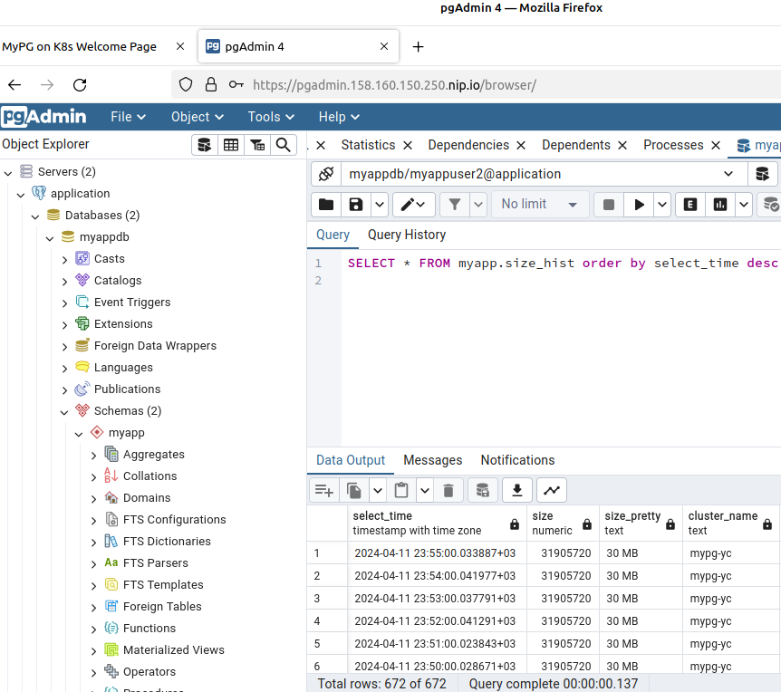 

Список коннектов у административного пользователя pgAdmin: 

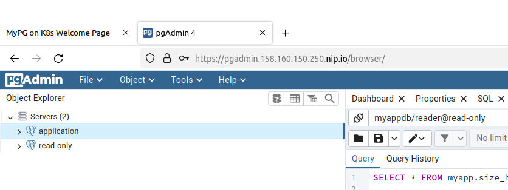 

Также для просмотра проекта создал еще одну учетную запись в pgAdmin4 (не административную), у которой в списке коннектов сохранен коннект под пользователем reader ("read-only"): 

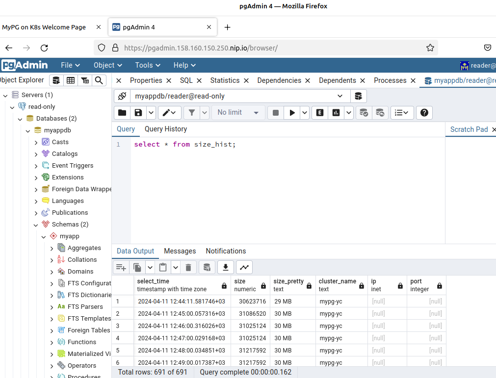 

И все эти изменения (пользователи приложения pgAdmin4, списки их коннектов) хранятся в нашем statefulset для pgAdmin4. 

</details>

## Отказоустойчивость

Как мы видели выше при установке MyPG, у нас запускается 2 инстанса (лидер и реплика, так и было задано в values в моем чарте): 

```bash
$ kubectl get pods -n mypg
NAME        READY   STATUS    RESTARTS   AGE
mypg-yc-1   1/1     Running   0          135m
mypg-yc-2   1/1     Running   0          133m
```

Автоматически при создании кластера PostgreSQL с помощью оператора CNPG полнимается три стандартных сервиса (read-write для подключения к лидеру, read-only для подключения к реплике/репликам, read для чтения с любых инстансов): 

```bash
$ kubectl get svc -n mypg -o wide
NAME             TYPE           CLUSTER-IP      EXTERNAL-IP      PORT(S)           AGE    SELECTOR
mypg-yc-r        ClusterIP      10.96.197.156   <none>           5432/TCP          138m   cnpg.io/cluster=mypg-yc,cnpg.io/podRole=instance
mypg-yc-ro       ClusterIP      10.96.195.52    <none>           5432/TCP          138m   cnpg.io/cluster=mypg-yc,role=replica
mypg-yc-rw       ClusterIP      10.96.189.66    <none>           5432/TCP          138m   cnpg.io/cluster=mypg-yc,role=primary
mypg-yc-svc-lb   LoadBalancer   10.96.194.30    158.160.161.26   51842:30301/TCP   138m   cnpg.io/cluster=mypg-yc,role=primary
```

(LoadBalancer - это сервис, созданный мои Helm Chart-ом без использования оператора CNPG) 

Т.о. мы свегда можем подключиться к инстансу, который является у нас лидером. 

Сами поды для хранения данных БД имеют PV, подключаемые через PVC. 

В случае уничтожения пода лидера, если кластер был развёрнут с одним инстансом, под перезупастится и продолжит работать с этой же БД (на том же PV), такой сценарий проверялся в локальном Minikube. 

В случае уничтожения пода лидера, если кластер был развёрнут более, чем с одним инстансом, произойдет failover (внеплановое переключение) на реплику. 

Также, на совсем крайний случай, есть регулярные бэкапы, которыми управляет оператор CNPG (о них будет рассказ в следующем разделе). 

<details>

<summary>подробности о PV и PVC, тесты отказоустойчивости</summary>

Посмотрим подробности о поде (в т.ч. PV): 

```yaml
$ kubectl get pods/mypg-yc-1 -o yaml
apiVersion: v1
kind: Pod
metadata:
  annotations:
    cnpg.io/nodeSerial: "1"
    cnpg.io/operatorVersion: 1.22.1
....................................................................................................
  labels:
    cnpg.io/cluster: mypg-yc
    cnpg.io/instanceName: mypg-yc-1
    cnpg.io/instanceRole: primary
    cnpg.io/podRole: instance
    role: primary
  name: mypg-yc-1
  namespace: mypg
....................................................................................................
spec:
....................................................................................................
  containers:
....................................................................................................
    env:
    - name: PGDATA
      value: /var/lib/postgresql/data/pgdata
    - name: POD_NAME
      value: mypg-yc-1
    - name: NAMESPACE
      value: mypg
    - name: CLUSTER_NAME
      value: mypg-yc
    - name: PGPORT
      value: "5432"
    - name: PGHOST
      value: /controller/run
    - name: TZ
      value: Europe/Moscow
    image: registry.gitlab.com/k8s-draft-kodmandvl/app:16.2
....................................................................................................
    name: postgres
    ports:
    - containerPort: 5432
      name: postgresql
      protocol: TCP
    - containerPort: 9187
      name: metrics
      protocol: TCP
    - containerPort: 8000
      name: status
      protocol: TCP
....................................................................................................
    volumeMounts:
    - mountPath: /var/lib/postgresql/data
      name: pgdata
....................................................................................................
    - mountPath: /etc/superuser-secret
      name: superuser-secret
    - mountPath: /etc/app-secret
      name: app-secret
....................................................................................................
  volumes:
  - name: pgdata
    persistentVolumeClaim:
      claimName: mypg-yc-1
....................................................................................................
  - name: superuser-secret
    secret:
      defaultMode: 420
      secretName: postgres-user-secret
  - name: app-secret
    secret:
      defaultMode: 420
      secretName: application-user-secret
....................................................................................................
```

В случае уничтожения пода лидера, если кластер был развёрнут с одним инстансом, под перезупастится и продолжит работать с этой же БД (на том же PV), такой сценарий проверялся в локальном Minikube. 

В случае уничтожения пода лидера, если кластер был развёрнут более, чем с одним инстансом, произойдет failover (внеплановое переключение) на реплику: 

```bash
$ kubectl delete pods/mypg-yc-1
pod "mypg-yc-1" deleted
$ kubectl get pods
NAME        READY   STATUS            RESTARTS   AGE
mypg-yc-1   0/1     PodInitializing   0          7s
mypg-yc-2   1/1     Running           0          3h25m
$ kubectl exec -it pods/mypg-yc-2 -- bash
Defaulted container "postgres" out of: postgres, bootstrap-controller (init)
[mypg-yc-2:/]$ psql
psql (16.2 (Debian 16.2-1.pgdg110+2))
Type "help" for help.

postgres@[local:/controller/run]:5432/postgres=# :role
  role  
--------
 LEADER
(1 row)

postgres@[local:/controller/run]:5432/postgres=# :uptime
              now              |         startup_time          |     uptime      
-------------------------------+-------------------------------+-----------------
 2024-04-11 16:12:03.053609+03 | 2024-04-11 12:46:14.842383+03 | 03:25:48.211226
(1 row)

postgres@[local:/controller/run]:5432/postgres=# \c myappdb 
You are now connected to database "myappdb" as user "postgres".
postgres@[local:/controller/run]:5432/myappdb=# select * from size_hist order by select_time desc limit 5;
          select_time          |   size   | size_pretty | cluster_name | ip | port 
-------------------------------+----------+-------------+--------------+----+------
 2024-04-11 16:12:00.02248+03  | 31815608 | 30 MB       | mypg-yc      |    |     
 2024-04-11 16:11:00.043989+03 | 31807416 | 30 MB       | mypg-yc      |    |     
 2024-04-11 16:10:00.022419+03 | 31807416 | 30 MB       | mypg-yc      |    |     
 2024-04-11 16:09:00.032825+03 | 31807416 | 30 MB       | mypg-yc      |    |     
 2024-04-11 16:08:00.027657+03 | 31799224 | 30 MB       | mypg-yc      |    |     
(5 rows)
```

После перезапуска пода mypg-yc-1 видим, что он уже догнал нового лидера mypg-yc-2: 

```bash
$ kubectl get pods
NAME        READY   STATUS    RESTARTS   AGE
mypg-yc-1   1/1     Running   0          4m8s
mypg-yc-2   1/1     Running   0          3h29m
$ kubectl exec -it pods/mypg-yc-1 -- bash
Defaulted container "postgres" out of: postgres, bootstrap-controller (init)
[mypg-yc-1:/]$ psql
psql (16.2 (Debian 16.2-1.pgdg110+2))
Type "help" for help.

postgres@[local:/controller/run]:5432/postgres=# :now
              now              
-------------------------------
 2024-04-11 16:15:28.513938+03
(1 row)

postgres@[local:/controller/run]:5432/postgres=# :lag
  role   |    lag    
---------+-----------
 STANDBY | 30.507204
(1 row)

postgres@[local:/controller/run]:5432/postgres=# \c myappdb 
You are now connected to database "myappdb" as user "postgres".
postgres@[local:/controller/run]:5432/myappdb=# select * from size_hist order by select_time desc limit 5;
          select_time          |   size   | size_pretty | cluster_name | ip | port 
-------------------------------+----------+-------------+--------------+----+------
 2024-04-11 16:15:00.028089+03 | 31823800 | 30 MB       | mypg-yc      |    |     
 2024-04-11 16:14:00.038501+03 | 31815608 | 30 MB       | mypg-yc      |    |     
 2024-04-11 16:13:00.025449+03 | 31815608 | 30 MB       | mypg-yc      |    |     
 2024-04-11 16:12:00.02248+03  | 31815608 | 30 MB       | mypg-yc      |    |     
 2024-04-11 16:11:00.043989+03 | 31807416 | 30 MB       | mypg-yc      |    |     
(5 rows)
```

Теперь, когда новый лидер у нас - mypg-yc-2, проведем другой сценарий на отказоустойчивость: удалим PV, полученный через PVC mypg/mypg-yc-2: 

```bash
$ kubectl delete pv pvc-96799076-285d-4cae-bdc3-cf1c588a53ce
persistentvolume "pvc-96799076-285d-4cae-bdc3-cf1c588a53ce" deleted
```

В другом окне: 

```bash
$ kubectl delete pods/mypg-yc-2
pod "mypg-yc-2" deleted
```

В третьем окне смотрим: 

```bash
$ kubectl get pods
NAME        READY   STATUS    RESTARTS   AGE
mypg-yc-1   1/1     Running   0          12m
mypg-yc-2   0/1     Running   0          12s
```

Через некоторое время: 

```bash
$ kubectl get pods
NAME        READY   STATUS    RESTARTS   AGE
mypg-yc-1   1/1     Running   0          12m
mypg-yc-2   1/1     Running   0          26s
```

Лидер у нас теперь снова mypg-yc-1, наши данные потеряны не были: 

```bash
$ kubectl exec -it pods/mypg-yc-1 -- bash
Defaulted container "postgres" out of: postgres, bootstrap-controller (init)
[mypg-yc-1:/]$ psql
psql (16.2 (Debian 16.2-1.pgdg110+2))
Type "help" for help.

postgres@[local:/controller/run]:5432/postgres=# :role
  role  
--------
 LEADER
(1 row)

postgres@[local:/controller/run]:5432/myappdb=# select * from size_hist order by select_time desc limit 5;
          select_time          |   size   | size_pretty | cluster_name | ip | port 
-------------------------------+----------+-------------+--------------+----+------
 2024-04-11 16:27:00.023415+03 | 31856568 | 30 MB       | mypg-yc      |    |     
 2024-04-11 16:26:00.022716+03 | 31856568 | 30 MB       | mypg-yc      |    |     
 2024-04-11 16:25:00.021485+03 | 31856568 | 30 MB       | mypg-yc      |    |     
 2024-04-11 16:24:00.020383+03 | 31856568 | 30 MB       | mypg-yc      |    |     
 2024-04-11 16:23:00.125192+03 | 31840184 | 30 MB       | mypg-yc      |    |     
(5 rows)
```

Под mypg-yc-2 пересоздался, но его PV так и не был удален, он находится в статусе `Terminating`, приглашение терминал, где было запущено удаление PV, не вернул, висит. 

Продолжил этот тест отказоустйчивости также удалением пода mypg-yc-2 и удалением его PVC и самого диска в Yandex Cloud. 

В итоге оператор создал новый под mypg-yc-3: 

```bash
$ kubectl get pods
NAME        READY   STATUS    RESTARTS   AGE
mypg-yc-1   1/1     Running   0          34m
mypg-yc-3   1/1     Running   0          3m17s
$ kubectl exec -it pods/mypg-yc-3 -- bash
Defaulted container "postgres" out of: postgres, bootstrap-controller (init)
[mypg-yc-3:/]$ psql
psql (16.2 (Debian 16.2-1.pgdg110+2))
Type "help" for help.

postgres@[local:/controller/run]:5432/postgres=# :lag
  role   |    lag    
---------+-----------
 STANDBY | 36.847975
(1 row)

postgres@[local:/controller/run]:5432/postgres=# :now
              now              
-------------------------------
 2024-04-11 16:45:41.182123+03
(1 row)

postgres@[local:/controller/run]:5432/postgres=# \c myappdb 
You are now connected to database "myappdb" as user "postgres".
postgres@[local:/controller/run]:5432/myappdb=# select * from size_hist order by select_time desc limit 5;
          select_time          |   size   | size_pretty | cluster_name | ip | port 
-------------------------------+----------+-------------+--------------+----+------
 2024-04-11 16:46:00.01917+03  | 31856568 | 30 MB       | mypg-yc      |    |     
 2024-04-11 16:45:00.03429+03  | 31856568 | 30 MB       | mypg-yc      |    |     
 2024-04-11 16:44:00.017746+03 | 31856568 | 30 MB       | mypg-yc      |    |     
 2024-04-11 16:43:00.026726+03 | 31856568 | 30 MB       | mypg-yc      |    |     
 2024-04-11 16:42:00.02872+03  | 31856568 | 30 MB       | mypg-yc      |    |     
(5 rows)
```

Видим, что новый под-реплика mypg-yc-3 успешно работает и догнал лидера. 

В целом все эти опыты доказывают отказоустйчивость нашего кластера (и это не говоря еще о бэкапах, о котороых будет подробнее рассказано в следующем разделе). 

</details>

## Бэкапы

Немаловажным фактором для нашей отказоустойчивости является удобство и автоматизация резервного копирования (в нашем случае с помощью утилиты barman на хранилище S3). 

<details>

<summary>подробности</summary>

После того, как кластер PostgreSQL инициализировался, уже сразу раз в 5 минут в объектное S3-хранилище скидываются архивные WAL-файлы (еще даже вне какого-либо настроенного расписания бэкапа самой БД): 

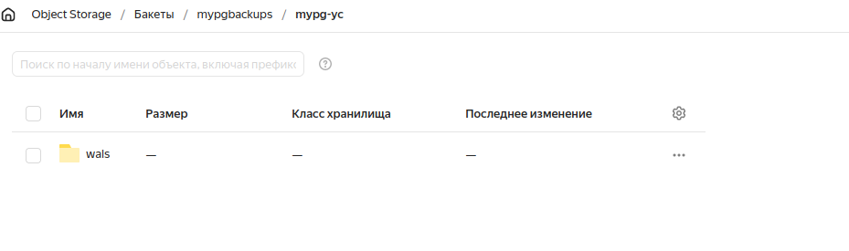 

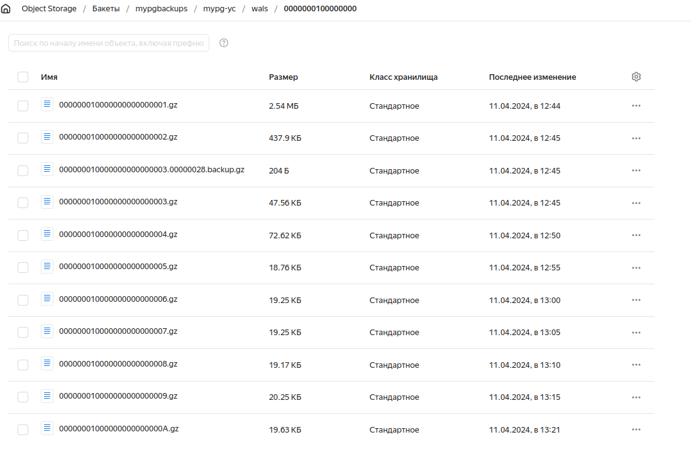 

Затем также создается псевдодиректория для бэкапов БД, когда начинают проходить бэкапы уже по расписанию: 

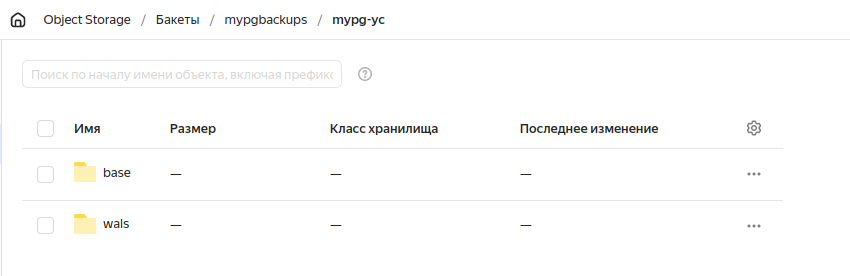 

Бэкапы у нас по мои values при деплое кластера PostgreSQL настроены раз в три часа на 31-й минуте часа на 15-й секунде, сейчас их на текущее время (по UTC) три: 

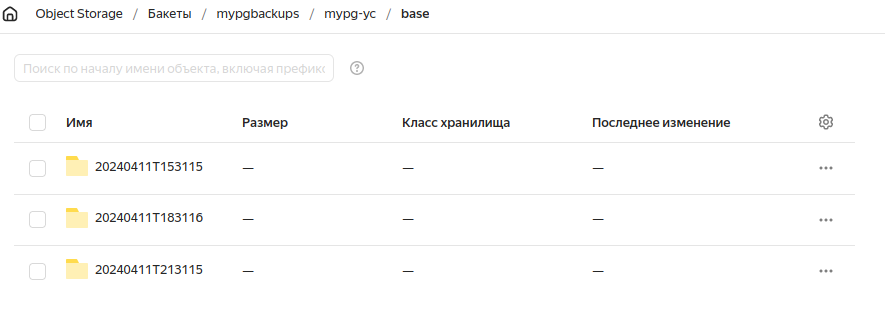 

Также можно посмотреть через kubectl: 

```bash
$ kubectl get backups -n mypg
NAME                            AGE     CLUSTER   METHOD              PHASE       ERROR
mypg-yc-backup-20240411123115   8h      mypg-yc   barmanObjectStore   completed   
mypg-yc-backup-20240411153115   5h59m   mypg-yc   barmanObjectStore   completed   
mypg-yc-backup-20240411183115   179m    mypg-yc   barmanObjectStore   completed   
```

Также можно по запросу выполнить бэкап в любой момент с помощью [плагина для CNPG](https://github.com/cloudnative-pg/cloudnative-pg/releases/): 

```bash
$ kubectl get backups -n mypg
NAME                            AGE     CLUSTER   METHOD              PHASE       ERROR
mypg-yc-backup-20240411123115   9h      mypg-yc   barmanObjectStore   completed   
mypg-yc-backup-20240411153115   6h6m    mypg-yc   barmanObjectStore   completed   
mypg-yc-backup-20240411183115   3h6m    mypg-yc   barmanObjectStore   completed   
mypg-yc-backup-20240411213115   6m59s   mypg-yc   barmanObjectStore   completed   
$ kubectl-cnpg backup mypg-yc
backup/mypg-yc-20240412003829 created
$ kubectl get backups -n mypg
NAME                            AGE     CLUSTER   METHOD              PHASE       ERROR
mypg-yc-20240412003829          6s      mypg-yc   barmanObjectStore   completed   
mypg-yc-backup-20240411123115   9h      mypg-yc   barmanObjectStore   completed   
mypg-yc-backup-20240411153115   6h7m    mypg-yc   barmanObjectStore   completed   
mypg-yc-backup-20240411183115   3h7m    mypg-yc   barmanObjectStore   completed   
mypg-yc-backup-20240411213115   7m20s   mypg-yc   barmanObjectStore   completed   
```

(пока выполнял эти действия и писал в README.md, по расписанию выполнился уже 4-й бэкап) 

Также можно в целом с помощью kubectl-cnpg посмотреть в целом оперативный статус-отчёт по кластеру, статусу инстансов, статусу архивации файлов WAL, отставанию реплик и т.д.: 

```bash
$ kubectl-cnpg status mypg-yc
Cluster Summary
Name:                mypg-yc
Namespace:           mypg
System ID:           7356543031634292755
PostgreSQL Image:    registry.gitlab.com/k8s-draft-kodmandvl/app:16.2
Primary instance:    mypg-yc-1
Primary start time:  2024-04-11 16:22:57 +0300 MSK (uptime 8h18m12s)
Status:              Cluster in healthy state 
Instances:           2
Ready instances:     2
Current Write LSN:   0/94005D28 (Timeline: 3 - WAL File: 000000030000000000000094)

Certificates Status
Certificate Name     Expiration Date                Days Left Until Expiration
----------------     ---------------                --------------------------
mypg-yc-client-cert  2024-07-10 09:43:44 +0000 UTC  89.50
mypg-yc-server-cert  2024-07-10 09:43:44 +0000 UTC  89.50

Continuous Backup status
First Point of Recoverability:  2024-04-11T15:31:29Z
Working WAL archiving:          OK
WALs waiting to be archived:    0
Last Archived WAL:              000000030000000000000093   @   2024-04-12T00:37:16.265721+03:00
Last Failed WAL:                00000003.history           @   2024-04-11T16:22:57.658051+03:00

Physical backups
No running physical backups found

Streaming Replication status
Replication Slots Enabled
Name       Sent LSN    Write LSN   Flush LSN   Replay LSN  Write Lag        Flush Lag       Replay Lag       State      Sync State  Sync Priority  Replication Slot
----       --------    ---------   ---------   ----------  ---------        ---------       ----------       -----      ----------  -------------  ----------------
mypg-yc-3  0/94005D28  0/94005D28  0/94005D28  0/94005D28  00:00:00.000582  00:00:00.00364  00:00:00.003648  streaming  async       0              active

Unmanaged Replication Slot Status
No unmanaged replication slots found

Managed roles status
No roles managed

Tablespaces status
No managed tablespaces

Instances status
Name       Database Size  Current LSN  Replication role  Status  QoS        Manager Version  Node
----       -------------  -----------  ----------------  ------  ---        ---------------  ----
mypg-yc-1  30 MB          0/94005D28   Primary           OK      Burstable  1.22.1           cl19e6lillii4ltjh02p-ikav
mypg-yc-3  30 MB          0/94005D28   Standby (async)   OK      Burstable  1.22.1           cl19e6lillii4ltjh02p-ujyk
```

Посмотреть ресурс ScheduledBackups: 

```bash
$ kubectl get scheduledbackups
NAME             AGE   CLUSTER   LAST BACKUP
mypg-yc-backup   12h   mypg-yc   12m
```

</details>

## Восстановление

Для проверки восстановления из наших бэкапов создадим кластер test-stand-yc, в котором будет указано название исходного кластера (mypg-yc) и реквизиты для подключения к S3-хранилищу. 

Будем считать, что это наш тестовый стенд, копия продакшена. 

Изначально такие тесты проводил на локальном чероновике в Minikube, возьмем за основу [соответствующий манифест](local_draft/mypg/test-stand-yc-cluster.yaml), а итоговый манифест, который мы сейчас используем, будет у нас будет находиться [здесь](recovery/test-stand-yc-cluster.yaml). 

<details>

<summary>подробности</summary>

Создадим тестовый стенд из бэкапа отредактированным манифестом и зафиксируем время, когда мы запустили создание кластера-копии: 

```bash
$ date
Пт 12 апр 2024 01:12:19 MSK
$ kubectl apply -f recovery/test-stand-yc-cluster.yaml -n mypg
cluster.postgresql.cnpg.io/test-stand-yc created
$ kubectl get all -l cnpg.io/cluster=test-stand-yc
NAME                                      READY   STATUS            RESTARTS   AGE
pod/test-stand-yc-1-full-recovery-lxtnm   0/1     PodInitializing   0          27s

NAME                       TYPE        CLUSTER-IP      EXTERNAL-IP   PORT(S)    AGE
service/test-stand-yc-r    ClusterIP   10.96.171.221   <none>        5432/TCP   29s
service/test-stand-yc-ro   ClusterIP   10.96.181.180   <none>        5432/TCP   29s
service/test-stand-yc-rw   ClusterIP   10.96.167.36    <none>        5432/TCP   28s

NAME                                      COMPLETIONS   DURATION   AGE
job.batch/test-stand-yc-1-full-recovery   0/1           28s        28s
```

Через некоторое время получаем успешно работающий standalone кластер PostgreSQL: 

```bash
$ kubectl get all -l cnpg.io/cluster=test-stand-yc
NAME                  READY   STATUS    RESTARTS   AGE
pod/test-stand-yc-1   1/1     Running   0          30s

NAME                       TYPE        CLUSTER-IP      EXTERNAL-IP   PORT(S)    AGE
service/test-stand-yc-r    ClusterIP   10.96.171.221   <none>        5432/TCP   2m5s
service/test-stand-yc-ro   ClusterIP   10.96.181.180   <none>        5432/TCP   2m5s
service/test-stand-yc-rw   ClusterIP   10.96.167.36    <none>        5432/TCP   2m4s
```

Отмечу, что в случае тестовой копии я не использовал наш CA myca и не создавал сервис LoadBalancer. 

Теперь посмотрим внутрь пода и сделаем выборку из нашей таблицы size_hist: 

```bash
$ kubectl exec -it pods/test-stand-yc-1 -- bash
Defaulted container "postgres" out of: postgres, bootstrap-controller (init)
[test-stand-yc-1:/]$ psql -d myappdb
psql (16.2 (Debian 16.2-1.pgdg110+2))
Type "help" for help.

postgres@[local:/controller/run]:5432/myappdb=# select * from size_hist order by select_time desc limit 10;
          select_time          |   size   | size_pretty | cluster_name  | ip | port 
-------------------------------+----------+-------------+---------------+----+------
 2024-04-12 01:20:00.02535+03  | 31913912 | 30 MB       | test-stand-yc |    |     
 2024-04-12 01:19:00.01427+03  | 31913912 | 30 MB       | test-stand-yc |    |     
 2024-04-12 01:18:00.01782+03  | 31913912 | 30 MB       | test-stand-yc |    |     
 2024-04-12 01:17:00.013723+03 | 31913912 | 30 MB       | test-stand-yc |    |     
 2024-04-12 01:16:00.031623+03 | 31913912 | 30 MB       | test-stand-yc |    |     
 2024-04-12 01:15:00.295782+03 | 31913912 | 30 MB       | test-stand-yc |    |     
 2024-04-12 01:12:00.041026+03 | 31913912 | 30 MB       | mypg-yc       |    |     
 2024-04-12 01:11:00.025888+03 | 31913912 | 30 MB       | mypg-yc       |    |     
 2024-04-12 01:10:00.019788+03 | 31913912 | 30 MB       | mypg-yc       |    |     
 2024-04-12 01:09:00.029525+03 | 31913912 | 30 MB       | mypg-yc       |    |     
(10 rows)
```
Видим, что наш кластер test-stand-yc восстановился из бэкапа кластера mypg-yc как раз на момент 2024-04-12 01:12 и уже в 2024-04-12 01:15:00 начинают добавляться строки уже в новой базе-копии. 

Также в БД postgres присутствуют созданные нами задания для pg_cron в таблице cron.job и журнал выполнения этих заданий: 

```bash
$ kubectl exec -it pods/test-stand-yc-1 -- bash
Defaulted container "postgres" out of: postgres, bootstrap-controller (init)
[test-stand-yc-1:/]$ psql
psql (16.2 (Debian 16.2-1.pgdg110+2))
Type "help" for help.

postgres@[local:/controller/run]:5432/postgres=# select jobid, jobname, active from cron.job;
 jobid |   jobname   | active 
-------+-------------+--------
     1 | vacuum_full | t
     2 | maintenance | t
     3 | history     | t
(3 rows)

postgres@[local:/controller/run]:5432/postgres=# select count(*) from cron.job_run_details ;
 count 
-------
   774
(1 row)
```

Т.о. восстановление из бэкапа прошло успешно, кластер PostgreSQL test-stand-yc соответсвует нашему исходному кластеру mypg-yc на момент применения соответствующего манифеста. 

Также сохраним коннект к этому новому кластеру в pgAdmin: 

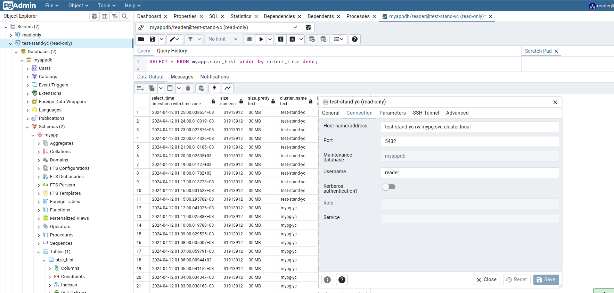 

Обратим внимание, что сертификаты для данного кластера-копии теперь используются сгенерированные самим оператором, это поведение по умолчанию (как выше я написал, для восстановления этой копии я не использовал наш CA myca и соответствующие свои сертификаты): 

```bash
$ kubectl exec -it pods/test-stand-yc-1 -- bash
Defaulted container "postgres" out of: postgres, bootstrap-controller (init)
[test-stand-yc-1:/]$ openssl x509 -in /controller/certificates/server.crt -text
Certificate:
    Data:
....................................................................................................
        Signature Algorithm: ecdsa-with-SHA256
        Issuer: OU = mypg, CN = test-stand-yc
        Validity
            Not Before: Apr 11 22:07:26 2024 GMT
            Not After : Jul 10 22:07:26 2024 GMT
        Subject: CN = test-stand-yc-rw
....................................................................................................
            X509v3 Subject Alternative Name: 
                DNS:test-stand-yc-rw, DNS:test-stand-yc-rw.mypg, DNS:test-stand-yc-rw.mypg.svc, DNS:test-stand-yc-r, DNS:test-stand-yc-r.mypg, DNS:test-stand-yc-r.mypg.svc, DNS:test-stand-yc-ro, DNS:test-stand-yc-ro.mypg, DNS:test-stand-yc-ro.mypg.svc, DNS:test-stand-yc-rw
....................................................................................................
[test-stand-yc-1:/]$ openssl x509 -in /controller/certificates/server-ca.crt -text
Certificate:
    Data:
....................................................................................................
        Signature Algorithm: ecdsa-with-SHA256
        Issuer: OU = mypg, CN = test-stand-yc
        Validity
            Not Before: Apr 11 22:07:26 2024 GMT
            Not After : Jul 10 22:07:26 2024 GMT
        Subject: OU = mypg, CN = test-stand-yc
....................................................................................................
```

</details>

## Мониторинг, часть 2

Теперь, когда у нас фунционируют два кластера PostgreSQL (mypg-yc и его тестовая копия test-stand-yc), посмотрим мониторинг. 

<details>

<summary>подробности</summary>

Дефолтный логин и пароль для Grafana указаны в документации, но также их можно посмотреть и в соответствующем секрете (и затем base64 -d): 

```bash
kubectl get -n mon secrets/prometheus-community-grafana -o yaml
```

Сделаем проброс порта для сервиса Grafana, чтобы подключиться, поменять пароль, импортировать дашборды, добавить пользователя для просмотра дашбордов: 

```bash
kubectl port-forward -n mon service/prometheus-community-grafana 3000:80
```

Также можно посмотреть в Prometheus: 

```bash
kubectl port-forward -n mon service/prometheus-community-kube-prometheus 9090:9090
```

Prometheus мы наружу выводить не будем, поэтому для него приведем текущий скриншот посредством проброса порта: 

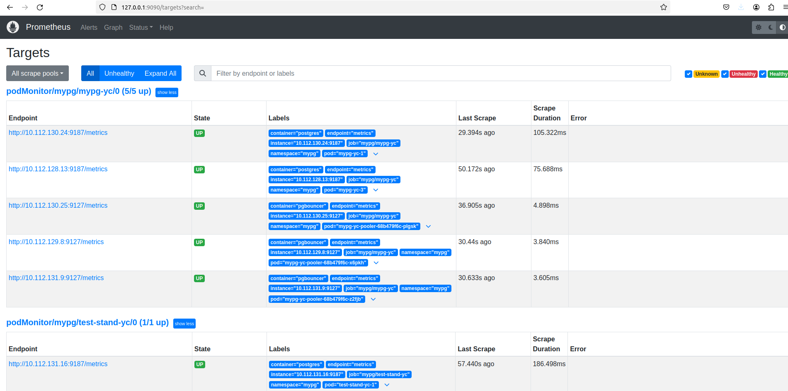 

Как раз видим здесь для кластера mypg-yc 2 инстанса PostgreSQL (лидера и реплику) и 3 реплики Pooler-а. 

Теперь, когда мы сменили пароль пользователя admin, для Grafana мы создадим Ingress: 

```bash
kubectl apply -n mon -f monitoring/grafana-ingress.yaml
kubectl get -n mon ingresses
```

Добавим это в .gitlab-ci.yml как stage grafana-ingress. 

Джоб grafana-ingress [выполнился успешно](https://gitlab.com/k8s-draft-kodmandvl/app/-/jobs/6607804129): 

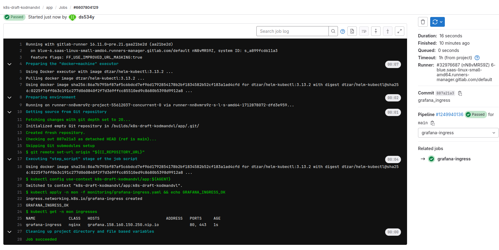 

Теперь к Grafana тоже можем подключаться снаружи. 

Теперь дадаим нагрузку на оба кластера PostgreSQL с помощью утилиты PGBench (для кластера mypg-yc через Pooler, для кластера test-stand-yc - локально на поде напрямую) и посмотрим на дашборды в Grafana. 

Нагрузка на `mypg-yc`: 

```bash
# Инициализация PGBench:
pgbench postgres://158.160.160.84.nip.io:51963/myappdb -U myappuser2 -i -s2 -n
# Нагрузка PGBench на 5 минут (можно несколько раз позапускать или увеличить время -T):
pgbench postgres://158.160.160.84.nip.io:51963/myappdb -U myappuser2 -T300 -P5 -j16 -c700 -n
```

Нагрузка на `test-stand-yc`: 

```bash
kubectl exec -it pods/test-stand-yc-1 -- bash
# Инициализация PGBench:
pgbench -d myappdb -U postgres -i -s2 -n
# Нагрузка PGBench на 5 минут (можно несколько раз позапускать или увеличить время -T):
pgbench -d myappdb -U postgres -T300 -P5 -j16 -c185 -n
```

Видим на графиках результат возросшей нагрузки, а также вспыхнувший алерт по ожиданиям клиентских процессов-бэкендов. 

Посомтрим на два немного отличающихся дашборда и на два наших кластера. 

**Первый кластер:** 

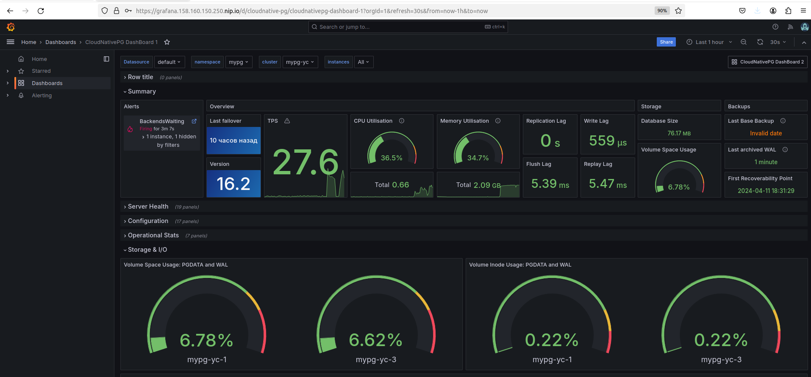 

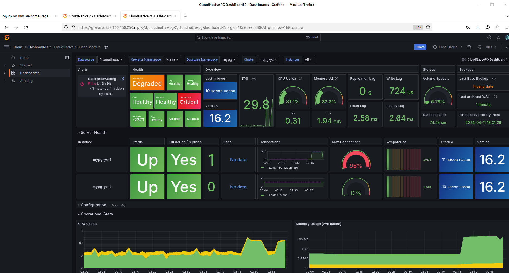 

Для Last Base Backup там указано "Invalid date" (возможно, это связано с таймзоной). 

**Второй кластер:** 

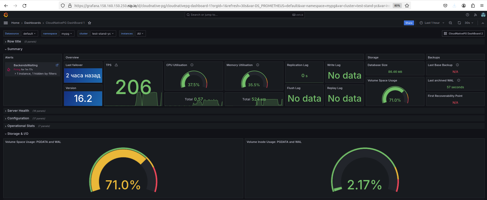 

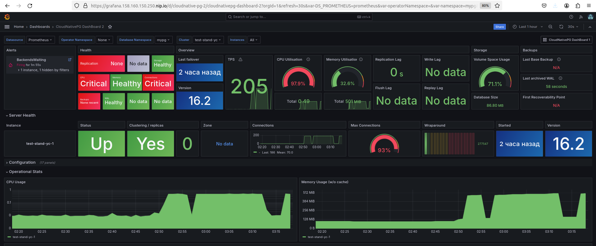 

По второму кластеру, помимо вспыхнувшего алерта, видим также ряд проблем, о которых сигнализирует нам Grafana: 

- отсутствие бэкапов (но мы их и не планировали выполнять на кластере test-stand-yc)
- отсутствие репликации (но мы и не создавали для этого кластера реплик, он standalone)
- и др.

Т.о. видим, что мониторинг у нас работает и есть срабатывающие правила для алертов (при необходимости, можно добавить для алертов каналы уведомлений, такие как почта или телеграм). 

</details>

## Стартовая страница проекта App

Стартовая страница была описана в разделе, посвященном моим Helm чартам, но приведем ее здесь еще раз в качестве итоговой результата работы: 

 

Данная страница доступна по следующим адресам: 

- https://web.158.160.150.250.nip.io/
- https://158.160.150.250.nip.io/web/
- https://158.160.150.250.nip.io/main
- https://158.160.150.250/main
- https://158.160.150.250/web/

Поправка: стартовая страница, приложения и сам кластер Kubernetes были доступны в рамках проверки проекта, а после проверки все эти ресурсы в Yandex Cloud были удалены. 

## Дальнейшие планы по развитию проекта App

- Дальнейшая параметризация Helm Chart-а MyPG (в т.ч. вынести в values параметры инстансов PostgreSQL для потенциально других сайзингов воркернод) и других своих Helm Chart-ов

