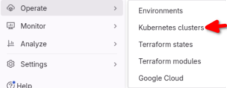

# gitlab-agent

Для работы сборок с нашим кластером K8s можно использовать секретную переменную с закодированным .kube/config (что проверял в первых примерах). 

Но более правильно и удобно использовать gitlab-agent. 

Настраивается он следующим образом: 

* Создаем его конфигурационный файл в нашем репозитории: 

 

Он будет называться k8s-draft-kodmandvl. 

Его содержимое: 

```yaml
ci_access:
  groups:
    - id: k8s-draft-kodmandvl/
```

Группа, в которой размещены проекты Infra и App, у нас называется k8s-draft-kodmandvl. 

В .gitlab-ci.yml будем использовать такую переменную для работы с нашим агентом: 

```yaml
..........
variables:
..........
  AGENT: k8s-draft-kodmandvl
..........
```

* В GitLab выбираем Operate => Kubernetes clusters:

 

* Выбираем наш агент и нажимаем "Register" (конфигурационный файл для агента уже должен быть запушен на этом шаге):

 

* Далее устанавливаем GitLab-агент с помощью предложенных команд:

```bash
helm repo add gitlab https://charts.gitlab.io
helm repo update
helm upgrade --install k8s-draft-kodmandvl gitlab/gitlab-agent \
    --namespace gitlab-agent \
    --create-namespace \
    --set image.tag=v16.11.0-rc2 \
    --set config.token=токен \
    --set config.kasAddress=wss://kas.gitlab.com
helm ls -n gitlab-agent
kubectl get all -n gitlab-agent
```

Там же и сгенерированный для нас токен указан в предложенных командах. 

Для удобства неймспейс использовал не предложенный (gitlab-agent-k8s-draft-kodmandvl), а просто gitlab-agent. 

* После успешной установки Helm Chart-а и успешного подключения агента видим статус "Connected":

 

* Теперь можно использовать его в сборках, проверочный пример .gitlab-ci.yml:

```yaml
# (My .gitlab-ci.yml test example with gitlab-agent)

stages:
  - check_conn_to_k8s

variables:
  AGENT: k8s-draft-kodmandvl

check_conn_to_k8s:
  image: dtzar/helm-kubectl:3.13.2
  stage: check_conn_to_k8s
  script:
    - kubectl config use-context k8s-draft-kodmandvl/app:${AGENT}
    - kubectl get nodes -o wide
```

* После коммита и пуша видим успешную сборку:

 

Успех! Теперь можно использовать его в сборках. 

* Успешно выполненный [джоб](https://gitlab.com/k8s-draft-kodmandvl/app/-/jobs/6582789717) создания неймспейсов: 

 

